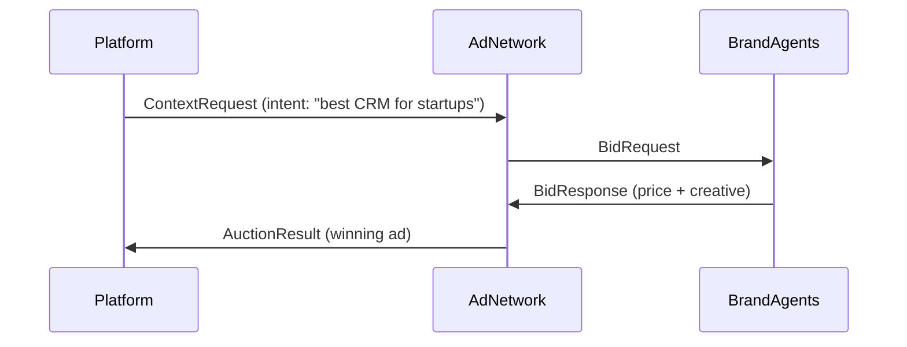

When an AI user expresses intent, AIP runs a **real-time auction** to determine which advertiser’s offer should appear.  
Every auction is privacy-safe, transparent, and built on verifiable logic.

---

## 1. TL;DR

> AIP auctions decide which advertiser offer best matches a user’s intent, balancing price, relevance, and trust.

---

## 2. Why it matters

Traditional ad systems optimize for the highest bidder.  
AIP optimizes for **verified value** — where the winning ad is both *relevant* to the user and *fairly priced* for the advertiser.  
This keeps AI experiences useful while still driving monetization.

---

## 3. How an auction works

Each user intent triggers a micro-auction that completes in under 300 ms.



1. The **Platform** sends a `ContextRequest` to the **Ad Network**.  
2. The **Ad Network** forwards that intent to multiple **Brand Agents**.  
3. Each Brand Agent returns a **BidResponse** with price, creative, and metadata.  
4. AIP scores all bids and sends back one **AuctionResult** to the platform.  

---

## 4. Scoring formula

AIP uses a **weighted scoring model** that rewards both relevance and verified performance.

| Factor | Description | Typical Weight |
|---------|--------------|----------------|
| **Bid Value** | Price per exposure, click, or conversion | 40% |
| **Relevance Score** | How well the ad matches the user’s query or conversation | 30% |
| **Trust Score** | Historical accuracy and event verification rate | 20% |
| **Latency & Quality** | Speed and success rate of agent responses | 10% |

**Final Score** = Weighted sum of all factors.

The highest total score wins, not just the highest bid.

---

## 5. The AuctionResult

The winning bid is returned to the platform as an `AuctionResult` object.

```json
{
  "auction_id": "auc_92b134",
  "winner": {
    "agent_id": "brand_quickbooks",
    "score": 0.87,
    "price": 0.05,
    "creative": "Try QuickBooks for Startups",
    "landing_url": "https://quickbooks.example"
  },
  "serve_token": "srv_20381f"
}
```

The `serve_token` connects this result to all future events (exposure, click, conversion).

---

## 6. Transparency and verification

Every auction and result is logged with:
- Signed request and response payloads  
- Timestamps and nonces  
- Version ID for reproducibility  

Ad Networks and Brand Agents can independently verify that:
- Their bids were received  
- Scoring was deterministic  
- The outcome was fair  

---

## 7. Example flow in plain language

1. User asks “Best AI note-taking tools.”  
2. Ad Network sends that intent to four Brand Agents.  
3. Each Brand Agent bids — Notion, Evernote, Otter, and ClickUp.  
4. AIP ranks them:  
   - Notion (score 0.92)  
   - ClickUp (0.81)  
   - Evernote (0.74)  
5. Notion wins. The AI platform shows a sponsored result: “Try Notion for teams.”  

---

## 8. Guarantees

- Every auction runs in real time and closes deterministically.  
- Scoring weights are transparent and auditable.  
- No two agents can manipulate results.  
- All participants can verify their bids post-auction.

---

## Summary

> AIP auctions balance relevance, trust, and price to choose the best possible ad for each AI conversation.

Next: [Events](/events)
