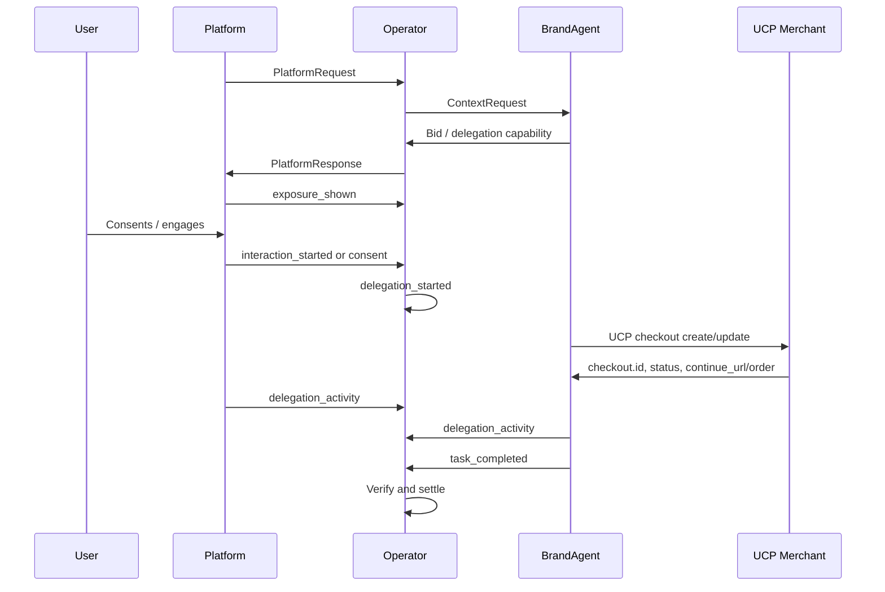

# AIP + Universal Commerce Protocol (UCP)

AIP and **Universal Commerce Protocol (UCP)** solve different parts of the stack.

- **AIP** governs participation, selection, delegation, attribution, and settlement
- **UCP** governs the downstream commerce workflow, especially checkout, identity linking, and order lifecycle

Use AIP to decide **who should participate** and how the interaction is measured.
Use UCP to execute the actual **commerce transaction** once the user is ready to buy.

Official UCP references:

- [UCP home](https://ucp.dev/2026-01-23/)
- [UCP overview](https://ucp.dev/2026-01-23/specification/overview/)
- [UCP checkout capability](https://ucp.dev/2026-01-23/specification/checkout/)

---

## 1. TL;DR

> AIP gets the user to the right commercial participant. UCP runs the checkout or order flow after that handoff. AIP remains the attribution and ad-performance system of record; UCP supplies the commerce proof.

---

## 2. When to use UCP with AIP

UCP is relevant when the selected Brand Agent needs to move from recommendation or delegation into a real commerce workflow such as:

- cart creation
- checkout session creation
- embedded checkout UI
- checkout handoff using a `continue_url`
- order creation and order-status updates

Typical AIP flows that hand off into UCP:

- **Recommend mode**: the user engages with a commerce recommendation and the platform or brand agent starts a UCP checkout
- **Delegate mode**: the user consents to a delegated commerce session and the brand agent starts or resumes a UCP checkout inside that delegated session

---

## 3. Separation of responsibilities

| Layer | Role |
|------|------|
| **AIP** | Intent capture, participation governance, selection, interaction mode, attribution, billing events, settlement |
| **UCP** | Checkout session lifecycle, trusted checkout UI, payment/shipping collection, order creation, order lifecycle |

UCP does **not** replace AIP events.
AIP does **not** replace checkout or order management.

---

## 4. Handoff model

### 4.1 Discovery

Once a commerce-capable Brand Agent is selected, the platform or brand agent can discover the seller's UCP capabilities from the business profile at:

`/.well-known/ucp`

UCP's initial core capabilities include:

- Checkout
- Identity Linking
- Order

For commerce handoff in AIP v1.0, Checkout is the main capability to integrate first.

### 4.2 Recommend-mode handoff

Use this when the user engages with a recommendation and then enters a commerce flow.

1. AIP returns a `PlatformResponse`
2. Platform logs `exposure_shown`
3. User engages and the platform logs `interaction_started`
4. Platform or Brand Agent starts a UCP checkout session
5. UCP returns a `checkout.id`, `status`, and possibly `continue_url`
6. When the commerce success point is reached, the Brand Agent emits AIP `task_completed`

### 4.3 Delegate-mode handoff

Use this when the user explicitly consents to a delegated commerce session.

1. AIP returns a delegation-capable `PlatformResponse`
2. User consents
3. Operator records `delegation_started`
4. Platform and Brand Agent continue the delegated task flow
5. Brand Agent starts or resumes a UCP checkout session
6. Platform and Brand Agent continue AIP `delegation_activity`
7. When the commerce success point is reached, the Brand Agent emits AIP `task_completed`

### 4.4 Trusted checkout and escalation

UCP checkout can require a trusted UI or escalation path. In UCP:

- checkout may return `requires_escalation`
- checkout may return a `continue_url`
- checkout sessions can expose an `expires_at`

Use these UCP values to drive the user experience, but keep AIP as the lifecycle and attribution layer around them.

---

## 5. Identifier mapping

Do not lose the join keys between AIP and UCP.

Recommended mapping:

| AIP field | UCP field / internal join |
|----------|----------------------------|
| `serve_token` | Stored alongside `checkout.id` and `order.id` |
| `session_id` | Stored alongside the checkout session |
| `delegation_session_id` | Stored alongside the checkout session for delegated flows |
| `agent_id` | Mapped to the commerce-capable Brand Agent or merchant connector |
| `platform_id` | Stored as the buyer-entry platform |
| `response_id` / `auction_id` | Internal attribution and settlement join keys |
| `task_completed.outcome_metadata.order_id` | UCP order identifier when available |
| Vendor extension or internal state | UCP checkout identifier and related checkout metadata |

Recommended minimum internal join table:

- `serve_token`
- `session_id`
- `delegation_session_id` if present
- `checkout_id`
- `order_id`
- `platform_id`
- `agent_id`
- `response_id`
- `auction_id`

---

## 6. Recommended success mapping

Pick one commerce success point and apply it consistently per merchant integration.

Recommended default:

- emit AIP `task_completed` when UCP reaches a **merchant-proven commerce completion state**
- in practice, this is usually one of:
  - UCP checkout reaches `completed`
  - a UCP order object is returned and persisted

Do **not** emit `task_completed` at checkout creation time.
Checkout creation is commerce progress, not a final outcome.

---

## 7. Measuring ad performance

Use **AIP for the ad funnel** and **UCP for commerce proof**.

### AIP funnel signals

- `exposure_shown`
- `interaction_started`
- `delegation_started`
- `delegation_activity`
- `delegation_expired`
- `task_completed`

### UCP commerce signals

- checkout created
- checkout updated
- checkout `status`
- checkout `expires_at`
- checkout `continue_url`
- order created
- later order updates if needed

### Recommended reporting funnel

1. exposure rate
2. engagement rate
3. delegation consent rate
4. checkout start rate
5. checkout completion rate
6. order conversion rate
7. revenue per `serve_token`
8. ROAS and revenue by platform, brand agent, campaign, and merchant

### Recommended attribution rule

- AIP remains the system of record for the commercial participation lifecycle
- UCP provides the transaction truth that justifies `task_completed`
- Join UCP outcomes back to AIP using `serve_token` plus checkout/order identifiers

---

## 8. Implementation guidance

### 8.1 Where to store UCP references

Without changing the AIP wire model, store UCP references in:

- internal operator state
- settlement and audit records
- `task_completed.outcome_metadata.order_id`
- optional vendor extensions for non-canonical UCP metadata such as:
  - `checkout_id`
  - `checkout_status`
  - `continue_url`
  - `ucp_profile_uri`

### 8.2 Session expiry alignment

UCP and AIP have separate session-expiry concepts:

- AIP delegated sessions expire according to `session_timeout_seconds` and verified `delegation_activity`
- UCP checkout sessions may expose their own `expires_at`

Implementations should track both:

- AIP session expiry for delegated-session liveness
- UCP checkout expiry for the commerce session itself

These timers should not be conflated.

### 8.3 Embedded vs escalated commerce

If UCP checkout stays inside the platform:

- continue emitting AIP lifecycle events
- treat the checkout as part of the same attributed flow

If UCP returns `requires_escalation` or a `continue_url`:

- preserve AIP identifiers across the handoff
- continue attributing the commerce flow to the same `serve_token`

---

## 9. Example sequence

---

## Summary

> Integrate AIP with UCP by using AIP for decisioning, attribution, and settlement, and UCP for checkout and order execution. Keep the join between `serve_token`, `checkout.id`, and `order.id`, and treat UCP completion as the proof source for AIP `task_completed`.
