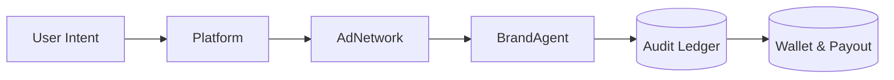

AIP is built for compliance from the ground up.  
It ensures that every action — from data capture to payout — adheres to privacy laws, financial regulations, and audit standards.

---

## 1. TL;DR

> Compliance in AIP means privacy, transparency, and trust — enforced by code, not policy.

---

## 2. Why it matters

Digital advertising historically struggled with opaque tracking and unverified reporting.  
AIP fixes this with a **privacy-first and audit-ready** design.  
Every piece of data has a clear purpose, owner, and retention policy.

This ensures alignment with major standards like:
- GDPR (Europe)  
- CCPA / CPRA (California)  
- SOC 2 Type II  
- ISO 27001  
- PCI DSS (for wallet and payout systems)

---

## 3. Data Principles

| Principle | Description |
|------------|-------------|
| **Minimalism** | Only intent context and event metadata are captured — never personal data. |
| **Purpose Limitation** | Data is processed solely for verification, settlement, and performance analysis. |
| **User Consent** | Platforms integrating AIP must surface clear consent for personalized or monetized responses. |
| **Right to Erasure** | All event records are anonymized and can be purged under valid user requests. |
| **Data Residency** | Regional data segregation ensures compliance with local jurisdictional laws. |

---

## 4. Data Flow and Ownership

- **Platform** owns consent and user context.  
- **Ad Network** intermediates verification and settlement.  
- **Brand Agent** sees only anonymized, intent-level data.  
- **Ledger** ensures all transactions are immutable and traceable.

---

## 5. Data Retention

| Data Type | Retention Period | Owner | Notes |
|------------|------------------|--------|-------|
| **Event Logs** | 90 days | Platform | Auto-purged post-verification |
| **Ledger Entries** | 5 years | Ad Network | Required for audit and tax compliance |
| **Wallet Records** | 7 years | Ad Network | Retained under financial reporting laws |
| **Aggregated Metrics** | Unlimited | All participants | Stored in anonymized form only |

---

## 6. Consent and Transparency

Each AI platform integrating AIP must clearly communicate when an ad is shown.  
Typical disclosure formats include:
- `[Ad]` or `[Sponsored]` label next to recommendations  
- "Why this ad?" explanation tooltip  
- Opt-out controls for sponsored responses

AIP enforces these disclosures through SDK requirements — not optional guidelines.

---

## 7. Financial and Audit Compliance

AIP’s ledger and wallet layers comply with standard financial audit frameworks.

| Area | Standard | Enforcement |
|-------|-----------|-------------|
| **Ledger Integrity** | SOC 2 Type II | Immutable event trails |
| **Payout Systems** | PCI DSS | Secure financial transactions |
| **Data Security** | ISO 27001 | End-to-end encryption |
| **Auditability** | GAAP-aligned | Exportable, time-stamped ledgers |

---

## 8. Independent Verification

All ledgers and logs can be externally verified through:
- Independent audit firms  
- Public hash verification endpoints  
- Encrypted proofs (Merkle-style) for transparency without exposure

This lets regulators and auditors confirm data integrity without seeing private records.

---

## 9. Breach and Incident Response

If a participant’s system is compromised:
1. Immediate ledger lock and key rotation occur.  
2. All pending transactions are quarantined for re-verification.  
3. Impact reports are distributed to affected participants.  
4. Recovery follows SOC 2 and ISO 27001 incident management protocols.

---

## 10. Guarantees

- Zero personal data exposure  
- Cryptographic audit trails for every transaction  
- Real-time compliance with GDPR/CCPA standards  
- Auditable financial ledgers and payouts  

---

## Summary

> AIP doesn’t treat compliance as a checkbox — it’s baked into the protocol itself.
It creates an ecosystem where every actor can prove compliance, not just claim it.
