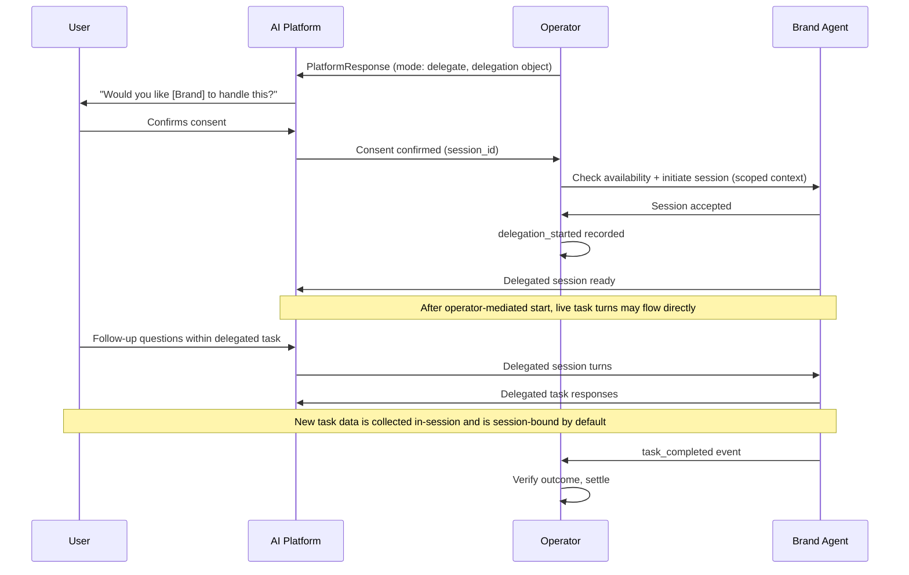

Delegation is AIP's mechanism for transitioning from an AI-driven decision to real-world action. When the Operator determines that delegate mode is appropriate, it initiates a delegation session by connecting the AI platform and the selected brand agent.

This is AIP's biggest upgrade over recommendation-only models. Delegation enables AI systems to complete tasks, not just suggest them.

---

## 1. TL;DR

> The Delegation Protocol defines how sessions are initiated, what context is shared, when user consent is required, and how outcomes are tracked through to settlement.

---

## 2. Why it matters

Without delegation, AI systems can only recommend. Users must leave the AI, navigate to a third-party site, and complete actions manually. Context is lost, attribution breaks, and outcomes are unverifiable.

AIP delegation solves this by defining:

- A structured handoff from AI to brand agent
- Scoped context that preserves user privacy
- Mandatory consent before session transfer
- End-to-end event tracking through the delegation lifecycle

---

## 3. Delegation object

When the Operator selects delegate mode, the PlatformResponse includes a delegation object:

```json
{
  "delegation": {
    "allowed": true,
    "agent_id": "delta_agent",
    "session_id": "sess_123",
    "context_scope": ["intent", "constraints"],
    "user_consent_required": true
  }
}
```

### Fields

| Field | Type | Required | Description |
|-------|------|----------|-------------|
| `allowed` | boolean | Yes | Whether delegation is permitted for this selection |
| `agent_id` | string | Yes | The brand agent selected to receive the session |
| `session_id` | string | Yes | Unique session identifier for the delegation |
| `context_scope` | string[] | Yes | What context is shared with the brand agent |
| `user_consent_required` | boolean | Yes | Whether user must explicitly consent (always `true` in v1.0) |

---

## 4. Context scope

The `context_scope` field defines what information is transferred to the brand agent during delegation. This enforces privacy boundaries.

### Allowed scope values

| Scope | What is shared |
|-------|---------------|
| `intent` | The classified intent (domain, subdomain, confidence) |
| `constraints` | User-stated constraints (budget, timeline, preferences) |
| `selection_context` | The selection context that led to this agent being chosen |
| `conversation_summary` | An anonymized summary of the conversation (no raw transcript) |

### What is never shared

- Raw user queries or conversation transcripts
- User identifiers (user_id, account IDs, device IDs)
- Platform session history beyond the current interaction
- Other brand agents' participation data

Operators define which scopes are available. The protocol guarantees that raw user data is never included regardless of scope configuration.

---

## 5. In-Session Information Flow

Delegation in AIP v1.0 uses a hybrid session model:

- The initial handoff is always operator-mediated
- After session start, live task turns may flow directly between the Platform and the Brand Agent
- The Operator remains the governance, scoping, audit, and settlement layer for the session
- The Operator does not inspect full delegated turn content by default

This means `context_scope` governs the operator-mediated handoff payload, not unlimited future access to upstream conversation data.

### What the Operator forwards at handoff

At session start, the Operator may forward only the scoped session-init payload declared in `context_scope`.

This payload may include:

- `intent`
- `constraints`
- `selection_context`
- `conversation_summary`

This payload MUST NOT include:

- Raw upstream user queries
- Raw conversation transcripts
- User identifiers
- Platform session history beyond the scoped summary or constraints

### What may happen after session start

After `delegation_started`, the user may continue the delegated task in a multi-turn session. In v1.0:

- The Platform may host or relay the live delegated session
- The Brand Agent may ask the user for additional information needed to complete the task
- The Platform and Brand Agent should emit delegated-session activity events so the Operator can track liveness
- New information provided during the delegated session is not automatically added to the original operator handoff scope
- New information is session-bound by default and may be used only to complete the active delegated task unless separately consented

No implicit scope expansion occurs mid-session in v1.0. Future scope expansion requires separate consent and explicit operator mediation in a later protocol revision.

---

## 6. Session initiation

Delegation follows a strict sequence:



### Rules

1. **Consent first.** The platform MUST present the delegation offer to the user and receive explicit confirmation before any session is created.
2. **One session per selection.** Each delegation creates exactly one session. If the user declines, no session is created and the serve token resolves as a recommend-mode participation.
3. **Scoped upstream handoff only.** At session initiation, the brand agent receives only the operator-forwarded context defined in `context_scope`. No additional upstream platform data may be shared.
4. **Operator-mediated initiation.** After the platform sends user consent, the Operator confirms brand-agent availability, initiates the session, and emits `delegation_started`.
5. **Session tracking.** The `session_id` in the delegation object links all events back to the original selection and serve token.
6. **Hybrid live session.** Once the session is initiated, live delegated turns may flow directly between the Platform and Brand Agent. The Operator still governs session identity, scope, auditability, and settlement.
7. **No implicit scope expansion.** Information shared after session start is not automatically added to `context_scope` and does not authorize unrestricted replay of upstream conversation data.
8. **Inactivity expiry.** `session_timeout_seconds` defines the delegated-session inactivity window. Each verified `delegation_activity` resets the timer. If the timer elapses, the Operator expires the session and records `delegation_expired`.
9. **Session-bound data.** New information the user provides during the delegated session may be used only to complete the active task unless separately consented.

---

## 7. Consent requirement

In AIP v1.0, `user_consent_required` is always `true` for delegation.

The platform is responsible for:

- Presenting the delegation offer clearly
- Identifying the brand agent by name
- Explaining what will happen if the user consents
- Making clear that the user is entering a brand-agent-managed task flow
- Recording the consent decision

The protocol does not prescribe the UI or wording. Platforms implement consent according to their own design standards.

If the user declines:
- No session is initiated
- The serve token is not invalidated
- The interaction falls back to recommend mode (the recommendation is still visible)
- `exposure_shown` may still be billable

---

## 8. Event tracking through delegation

Delegation introduces additional lifecycle events beyond the standard recommend flow:

| Event | When fired | Who fires it |
|-------|-----------|-------------|
| `exposure_shown` | Selection result delivered to platform | Platform |
| `delegation_started` | User consent is confirmed, brand-agent availability is confirmed, and the delegated session is initiated | Operator |
| `delegation_activity` | Delegated session remains active through user turns, agent turns, or keepalive signals | Platform or Brand Agent |
| `delegation_expired` | Delegated session expires before task completion | Operator |
| `task_completed` | User completes the target action | Brand Agent (via Operator) |

`delegation_started` proves that the delegated session was authorized and initiated. It does **not** imply that the Operator transports or inspects every subsequent turn in the live delegated session.

### Settlement rules for delegation

- If the user consents and completes the task: `task_completed` (CPA) is billed
- If the session remains active, the Platform and Brand Agent continue emitting `delegation_activity`
- If the inactivity timer elapses before completion: the Operator records `delegation_expired`
- If the user consents but does not complete: `delegation_started` may be billed (operator-defined)
- If the user declines delegation: `exposure_shown` (CPX) may be billed
- Only the highest-value event is billed per serve token

---

## 9. Brand agent responsibilities in delegation

Brand agents that support delegate mode MUST:

- Accept session initiation from the Operator
- Use the scoped handoff data only for session initiation and task execution
- Respect context scope boundaries and not treat `context_scope` as blanket access to upstream conversation history
- Provide a functional experience that completes the intended task
- Emit `delegation_activity` while the delegated session remains active
- Fire `task_completed` when the outcome is verified
- Treat new user-provided information as session-bound by default
- Handle session timeouts and errors gracefully

Brand agents MAY:

- Support both recommend and delegate modes
- Implement their own UI and workflow within the session
- Request additional information directly from the user during the session when needed to complete the task

Brand agents MUST NOT:

- Reuse delegated-session data for training, profiling, or future outreach without separate consent
- Treat data collected in-session as authorization to expand the original handoff scope

---

## 10. Example: Full delegation flow

**User:** "Sign me up for QuickBooks"

1. Platform sends PlatformRequest with transactional intent (domain: accounting, action: signup)
2. Operator evaluates eligibility  -  participation is allowed
3. Operator runs selection  -  QuickBooks agent is selected
4. Operator determines delegate mode based on transactional intent
5. Platform shows: "QuickBooks can handle your signup. Proceed?"
6. User confirms
7. Platform sends consent to the Operator
8. Operator checks QuickBooks agent availability and initiates the delegated session with scoped context: `["intent", "constraints"]`
9. Operator records `delegation_started`
10. Platform enters the delegated session and routes the live task flow to the QuickBooks agent
11. Platform and QuickBooks emit `delegation_activity` while the session remains active
12. User provides any additional signup details inside the delegated session
13. QuickBooks agent uses that new information only to complete the active signup flow
14. User completes signup
15. QuickBooks agent fires `task_completed` with conversion details
16. Operator verifies the outcome against the serve token
17. Settlement: CPA is charged and recorded

---

## 11. Guarantees

- Delegation always requires user consent
- Context shared with brand agents is scoped and never includes raw user data
- Each delegation session is linked to exactly one serve token
- Live delegated turns may be direct after operator-mediated session start
- The Operator remains the governance and audit layer even when live turns are direct
- Delegated sessions expire on inactivity according to `session_timeout_seconds`
- Session liveness is proven through delegated-session activity events from Platforms and Brand Agents
- Data collected during the delegated session is session-bound by default
- Outcomes are independently verifiable
- Settlement follows the same event ladder as recommend mode (highest event wins)

---

## Summary

> The Delegation Protocol is what makes AIP more than a recommendation engine. It defines a structured, consent-driven, privacy-respecting mechanism for AI systems to hand off real tasks to commercial agents  -  with full lifecycle tracking and outcome-based settlement.

---
