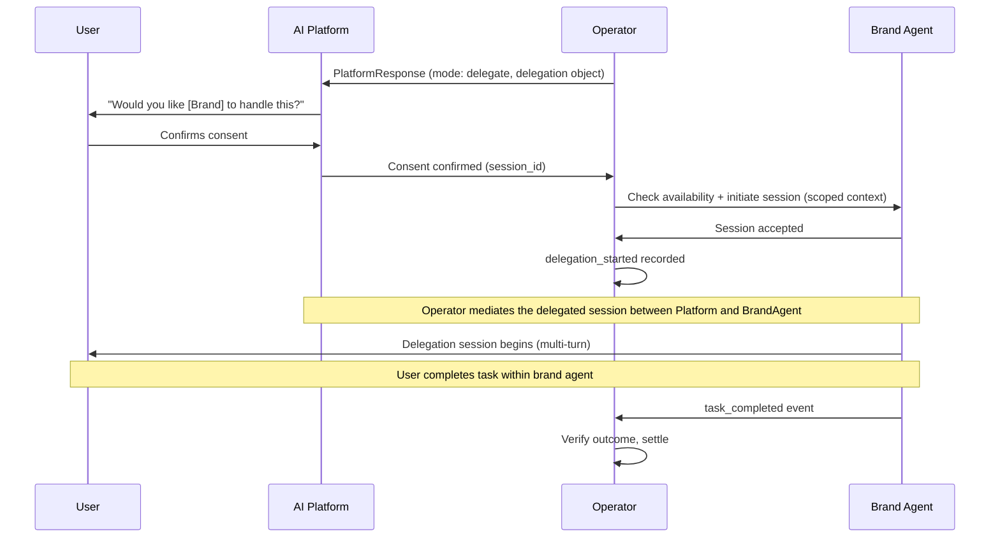

Delegation is AIP's mechanism for transitioning from an AI-driven decision to real-world action. When the Operator determines that delegate mode is appropriate, it initiates a delegation session by connecting the AI platform and the selected brand agent.

This is AIP's biggest upgrade over recommendation-only models. Delegation enables AI systems to complete tasks, not just suggest them.

---

## 1. TL;DR

> The Delegation Protocol defines how sessions are initiated, what context is shared, when user consent is required, and how outcomes are tracked through to settlement.

---

## 2. Why it matters

Without delegation, AI systems can only recommend. Users must leave the AI, navigate to a third-party site, and complete actions manually. Context is lost, attribution breaks, and outcomes are unverifiable.

AIP delegation solves this by defining:

- A structured handoff from AI to brand agent
- Scoped context that preserves user privacy
- Mandatory consent before session transfer
- End-to-end event tracking through the delegation lifecycle

---

## 3. Delegation object

When the Operator selects delegate mode, the PlatformResponse includes a delegation object:

```json
{
  "delegation": {
    "allowed": true,
    "agent_id": "delta_agent",
    "session_id": "sess_123",
    "context_scope": ["intent", "constraints"],
    "user_consent_required": true
  }
}
```

### Fields

| Field | Type | Required | Description |
|-------|------|----------|-------------|
| `allowed` | boolean | Yes | Whether delegation is permitted for this selection |
| `agent_id` | string | Yes | The brand agent selected to receive the session |
| `session_id` | string | Yes | Unique session identifier for the delegation |
| `context_scope` | string[] | Yes | What context is shared with the brand agent |
| `user_consent_required` | boolean | Yes | Whether user must explicitly consent (always `true` in v1.0) |

---

## 4. Context scope

The `context_scope` field defines what information is transferred to the brand agent during delegation. This enforces privacy boundaries.

### Allowed scope values

| Scope | What is shared |
|-------|---------------|
| `intent` | The classified intent (domain, subdomain, confidence) |
| `constraints` | User-stated constraints (budget, timeline, preferences) |
| `selection_context` | The selection context that led to this agent being chosen |
| `conversation_summary` | An anonymized summary of the conversation (no raw transcript) |

### What is never shared

- Raw user queries or conversation transcripts
- User identifiers (user_id, account IDs, device IDs)
- Platform session history beyond the current interaction
- Other brand agents' participation data

Operators define which scopes are available. The protocol guarantees that raw user data is never included regardless of scope configuration.

---

## 5. Session initiation

Delegation follows a strict sequence:



### Rules

1. **Consent first.** The platform MUST present the delegation offer to the user and receive explicit confirmation before any session is created.
2. **One session per selection.** Each delegation creates exactly one session. If the user declines, no session is created and the serve token resolves as a recommend-mode participation.
3. **Scoped context only.** The brand agent receives only the context defined in `context_scope`. No additional data may be shared.
4. **Operator-mediated initiation.** After the platform sends user consent, the Operator confirms brand-agent availability, initiates the session, and emits `delegation_started`.
5. **Session tracking.** The `session_id` in the delegation object links all events back to the original selection and serve token.
6. **Multi-turn session.** Once the session is initiated, the user may ask multiple questions. The Brand Agent responds within the delegated session on behalf of the AI platform while representing its brand.

---

## 6. Consent requirement

In AIP v1.0, `user_consent_required` is always `true` for delegation.

The platform is responsible for:

- Presenting the delegation offer clearly
- Identifying the brand agent by name
- Explaining what will happen if the user consents
- Recording the consent decision

The protocol does not prescribe the UI or wording. Platforms implement consent according to their own design standards.

If the user declines:
- No session is initiated
- The serve token is not invalidated
- The interaction falls back to recommend mode (the recommendation is still visible)
- `exposure_shown` may still be billable

---

## 7. Event tracking through delegation

Delegation introduces additional lifecycle events beyond the standard recommend flow:

| Event | When fired | Who fires it |
|-------|-----------|-------------|
| `exposure_shown` | Selection result delivered to platform | Platform |
| `delegation_started` | User consent is confirmed, brand-agent availability is confirmed, and the delegated session is initiated | Operator |
| `task_completed` | User completes the target action | Brand Agent (via Operator) |

### Settlement rules for delegation

- If the user consents and completes the task: `task_completed` (CPA) is billed
- If the user consents but does not complete: `delegation_started` may be billed (operator-defined)
- If the user declines delegation: `exposure_shown` (CPX) may be billed
- Only the highest-value event is billed per serve token

---

## 8. Brand agent responsibilities in delegation

Brand agents that support delegate mode MUST:

- Accept session initiation from the Operator
- Respect context scope boundaries  -  do not request additional user data
- Provide a functional experience that completes the intended task
- Fire `task_completed` when the outcome is verified
- Handle session timeouts and errors gracefully

Brand agents MAY:

- Support both recommend and delegate modes
- Implement their own UI and workflow within the session
- Request additional information directly from the user during the session (with consent)

---

## 9. Example: Full delegation flow

**User:** "Sign me up for QuickBooks"

1. Platform sends PlatformRequest with transactional intent (domain: accounting, action: signup)
2. Operator evaluates eligibility  -  participation is allowed
3. Operator runs selection  -  QuickBooks agent is selected
4. Operator determines delegate mode based on transactional intent
5. Platform shows: "QuickBooks can handle your signup. Proceed?"
6. User confirms
7. Platform sends consent to the Operator
8. Operator checks QuickBooks agent availability and initiates the delegated session with scoped context: `["intent", "constraints"]`
9. Operator records `delegation_started`
10. QuickBooks agent initiates signup flow
11. User completes signup
12. QuickBooks agent fires `task_completed` with conversion details
13. Operator verifies the outcome against the serve token
14. Settlement: CPA is charged and recorded

---

## 10. Guarantees

- Delegation always requires user consent
- Context shared with brand agents is scoped and never includes raw user data
- Each delegation session is linked to exactly one serve token
- Outcomes are independently verifiable
- Settlement follows the same event ladder as recommend mode (highest event wins)

---

## Summary

> The Delegation Protocol is what makes AIP more than a recommendation engine. It defines a structured, consent-driven, privacy-respecting mechanism for AI systems to hand off real tasks to commercial agents  -  with full lifecycle tracking and outcome-based settlement.

---
