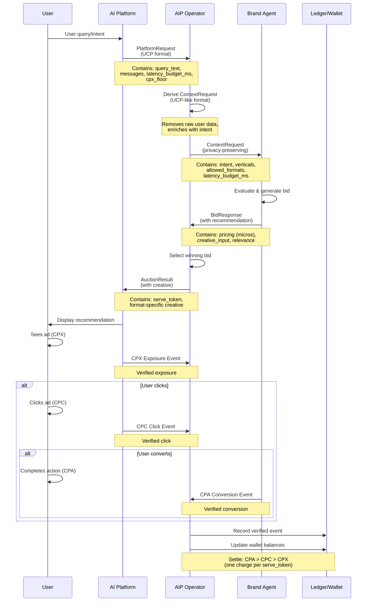

## Flow Overview

The end-to-end AIP flow connects AI Platforms, Operators, and Brand Agents through a series of request/response cycles, auctions, and event verifications.



## 1. Platform Request (AI Platform → Operator)

**Schema:** [`platform-request.json`](/schemas/platform-request)

The AI platform initiates an ad auction by sending a `PlatformRequest` to the operator.

### Key Fields:
- `spec_version`: UCP specification version (e.g., "1.0.0")
- `message_id`: Unique identifier for this auction request
- `timestamp`: ISO 8601 timestamp
- `producer`: Producer information (agent_id, agent_role, software, software_version)
- `context`: Context information (language, publisher, placement, device, geography)
- `identity`: Identity information (namespace, value_hash, confidence)
- `extensions.aip`: AIP extension containing session_id, turn_index, query_text, messages, latency_budget_ms, cpx_floor

### Example:
```json
{
  "spec_version": "1.0.0",
  "message_id": "req_92fA1",
  "timestamp": "2025-11-14T18:22:00Z",
  "producer": {
    "agent_id": "openai_chat",
    "agent_role": "publisher",
    "software": "chatgpt",
    "software_version": "4.3-mini"
  },
  "context": {
    "language": "en-US",
    "publisher": "openai_chat",
    "placement": {
      "ad_unit": "conversation"
    },
    "device": {
      "platform": "web",
      "form_factor": "desktop"
    },
    "geography": {
      "country": "US"
    }
  },
  "identity": {
    "namespace": "platform_user",
    "value_hash": "user_hash_abc123",
    "confidence": 1.0
  },
  "extensions": {
    "aip": {
      "session_id": "sess_001",
      "turn_index": 3,
      "query_text": "best CRM for small teams",
      "messages": [
        { "role": "user", "content": "best CRM tools?" },
        { "role": "assistant", "content": "HubSpot, Zoho, Salesforce…" }
      ],
      "latency_budget_ms": 500,
      "cpx_floor": 0.05
    }
  }
}
```

---

## 2. Context Request (Operator → Brand Agents)

**Schema:** [`context-request.json`](/schemas/context-request)

The operator normalizes the platform request and enriches it with intent analysis, then sends a `ContextRequest` to brand agents.

### Key Fields:
- `spec_version`: AIP specification version (default: "aip/1.0")
- `message_id`: Unique identifier (maps to PlatformRequest message_id)
- `timestamp`: ISO 8601 timestamp
- `producer`: Producer information (from PlatformRequest)
- `session_id`: Conversation or interaction session ID
- `turn_index`: Turn index in the conversation
- `context_id`: Unique ID for this auction request
- `language`: User locale in BCP 47 format
- `publisher`: Publisher identifier
- `placement`: Placement information (ad_unit)
- `device`: Device information (platform, form_factor)
- `geography`: Geographic information (country)
- `intent`: Operator-generated semantic understanding
  - `type`: "informational" | "commercial" | "transactional"
  - `decision_phase`: "research" | "compare" | "decide" | "act"
  - `confidence`: Confidence score (0.0-1.0)
  - `summary`: Short summary of conversation context
  - `operator_relevance_score`: Operator's relevance score (optional)
- `verticals`: Normalized topical verticals (e.g., ["crm", "smb_software"])
- `allowed_formats`: Creative formats allowed (["weave", "tail", "product_card", "bridge"])
- `latency_budget_ms`: Platform latency budget in milliseconds (optional)

### Example:
```json
{
  "spec_version": "aip/1.0",
  "message_id": "req_92fA1",
  "timestamp": "2025-11-14T18:22:00Z",
  "producer": {
    "agent_id": "openai_chat",
    "agent_role": "publisher",
    "software": "chatgpt",
    "software_version": "4.3-mini"
  },
  "session_id": "sess_001",
  "turn_index": 3,
  "latency_budget_ms": 500,
  "allowed_formats": ["weave", "tail", "product_card"],
  "context_id": "ctx_92fA1",
  "language": "en-US",
  "publisher": "openai_chat",
  "placement": {
    "ad_unit": "conversation"
  },
  "device": {
    "platform": "web",
    "form_factor": "desktop"
  },
  "geography": {
    "country": "US"
  },
  "intent": {
    "type": "commercial",
    "decision_phase": "compare",
    "confidence": 0.87,
    "summary": "User is evaluating CRM tools and narrowing down options.",
    "operator_relevance_score": 0.87
  },
  "verticals": ["crm", "smb_software"]
}
```

---

## Auction Window and Timing

AIP uses a time-bounded auction window to ensure low latency and predictable outcomes.

* The auction window is derived from the PlatformRequest `latency_budget_ms` field
* The Operator computes the available bid window by subtracting operator-side overhead (classification, filtering, dispatch) from the platform's latency budget
* The auction window begins when the ContextRequest is published
* Brand Agents MUST submit a BidResponse before the computed window expires
* If `latency_budget_ms` is not provided, the Operator MUST apply a default fallback

If the window expires with no bids, the outcome is treated as `no_bid`. Late bids are ignored and do not participate in selection or settlement.

---

## 3. Bid (Brand Agents → Operator)

**Schema:** [`bid.json`](/schemas/bid)

Brand agents evaluate the context request and submit bids containing pricing and creative input.

### Key Fields:
- `bid_id`: Unique identifier for this bid
- `brand_agent_id`: Identifier of the brand agent
- `context_id`: ID of the ContextRequest being bid on
- `wallet_id`: Wallet to debit if the bid wins
- `pricing`: Pricing vector with micros (authoritative), cents (display), and dollars (UI)
  - `currency`: Currency code (ISO 4217)
  - `display_currency`: Display currency code
  - `cpx_micros`: Price per exposure in USD micros (authoritative)
  - `cpx_cents`: Price per exposure in cents (for display)
  - `cpx_dollars`: Price per exposure in dollars (for UI)
  - `cpc_micros`: Price per click in USD micros (optional)
  - `cpc_cents`: Price per click in cents (optional)
  - `cpc_dollars`: Price per click in dollars (optional)
  - `cpa_micros`: Price per conversion in USD micros (optional)
  - `cpa_cents`: Price per conversion in cents (optional)
  - `cpa_dollars`: Price per conversion in dollars (optional)
  - `preferred_pricing_model`: Preferred billing model ("CPX", "CPC", or "CPA")
- `recommendation.creative_input`: Unified creative input structure
- `relevance`: Relevance score (0.0-1.0, required)
- `preferred_format`: Preferred creative format (optional)
- `processing_latency_ms`: Round-trip latency in milliseconds (optional)

### Example:
```json
{
  "bid_id": "bid_7823",
  "brand_agent_id": "brand_agent_123",
  "context_id": "ctx_92f",
  "wallet_id": "wallet_890",
  "pricing": {
    "currency": "USD",
    "display_currency": "USD",
    "cpx_micros": 50000,
    "cpx_cents": 5,
    "cpx_dollars": 0.05,
    "cpc_micros": 450000,
    "cpc_cents": 45,
    "cpc_dollars": 0.45,
    "cpa_micros": 10000000,
    "cpa_cents": 1000,
    "cpa_dollars": 10.0,
    "preferred_pricing_model": "CPA"
  },
  "recommendation": {
    "creative_input": {
      "brand_name": "Nimbus",
      "product_name": "Nimbus CRM Pro",
      "short_description": "CRM built for growing teams, with AI-assisted workflows.",
      "long_description": "Nimbus CRM Pro is designed for teams of 5-50 people who need intelligent pipeline management.",
      "value_props": [
        "Automated pipeline insights",
        "Collaborative forecasting"
      ],
      "context_snippet": "For startups needing higher limits and automated expense workflows.",
      "cta_label": "Start Free Trial",
      "cta_url": "https://nimbus.example.com/signup",
      "assets": {
        "logo_url": "https://cdn.example.com/nimbus/logo.png",
        "image_urls": ["https://cdn.example.com/nimbus/crm.png"],
        "resource_urls": ["https://nimbus.example.com/signup"]
      }
    }
  },
  "timestamp": "2025-11-11T18:00:01Z",
  "relevance": 0.87,
  "preferred_format": "weave",
  "processing_latency_ms": 42
}
```

---

## 4. Creative Input (Part of Bid)

The unified creative input structure that brand agents generate. Contains all fields needed for any ad format.

### Key Fields:
- `brand_name`: Brand or advertiser name
- `product_name`: Product or offer name
- `short_description`: 1-2 sentence summary (max 200 chars)
- `long_description`: 2-4 sentence expanded description (max 500 chars)
- `value_props`: Short value propositions or bullet points
- `context_snippet`: 60-100 character contextual hint for weave format
- `cta_label`: Call-to-action label
- `cta_url`: Call-to-action URL
- `assets`: Creative assets (logo, images, resource URLs)

---

## 5. Auction Result (Operator → AI Platform)

**Schema:** [`auction-result.json`](/schemas/auction-result)

The operator selects the winning bid, generates format-specific creative, and returns the result to the AI platform.

### Key Fields:
- `auction_id`: Unique identifier for this auction
- `serve_token`: Token used to track downstream events
- `winner`: Winning bid info
  - `brand_agent_id`: Winning Brand Agent
  - `preferred_unit`: Requested billing unit (CPX, CPC, or CPA)
  - `reserved_amount_cents`: Amount placed on hold at auction time
- `render`: Format-specific creative content
- `ttl_ms`: Time-to-live in milliseconds (1000-300000)

### Example:
```json
{
  "auction_id": "auc_981",
  "serve_token": "stk_abcxyz123",
  "winner": {
    "brand_agent_id": "ba_451",
    "preferred_unit": "CPA",
    "reserved_amount_cents": 500
  },
  "render": {
    "format": "weave",
    "weave_content": "[Ad] For startups needing higher limits and automated expense workflows. CRM built for growing teams, with AI-assisted workflows. Learn more: https://admesh.click/stk_abcxyz123"
  },
  "ttl_ms": 60000
}
```

---

## 6. Creative (Part of Auction Result)

Format-specific creative content generated by the operator from CreativeInput. Supports three formats: weave, tail, and product_card.

### Format 1: Weave
Short, inline, contextual text to insert into assistant response.

```json
{
  "format": "weave",
  "weave_content": "[Ad] For startups needing higher limits and automated expense workflows. CRM built for growing teams, with AI-assisted workflows. Learn more: https://admesh.click/stk_abcxyz123"
}
```

### Format 2: Tail
Paragraph-level block ad to show after organic response.

```json
{
  "format": "tail",
  "tail_content": "Nimbus CRM Pro is designed for teams of 5-50 people who need intelligent pipeline management.\n\nStart Free Trial: https://admesh.click/stk_abcxyz123"
}
```

### Format 3: Product Card
Structured card data with title, description, value props, and assets.

```json
{
  "format": "product_card",
  "product_card": {
    "title": "Nimbus CRM Pro",
    "subtitle": "Nimbus",
    "description": "CRM built for growing teams, with AI-assisted workflows.",
    "value_props": [
      "Automated pipeline insights",
      "Collaborative forecasting"
    ],
    "assets": {
      "logo_url": "https://cdn.example.com/nimbus/logo.png",
      "primary_image_url": "https://cdn.example.com/nimbus/crm.png"
    },
    "admesh_url": "https://admesh.click/stk_abcxyz123"
  }
}
```

---

## 7. Events (Platform → Operator)

After the ad is served, the platform sends events to track user engagement.

### 7.1 CPX Exposure Event

Sent when the user sees the ad.

```json
{
  "event_id": "evt_cpx_001",
  "serve_token": "stk_abcxyz123",
  "event_type": "cpx_exposure",
  "timestamp": "2025-11-14T18:22:05Z",
  "platform_id": "openai_chat",
  "session_id": "sess_001",
  "user_id": "user_hash_abc123",
  "geo": "US",
  "auth": {
    "nonce": "nonce_exposure_123",
    "sig": "sig_exposure_456"
  }
}
```

### 7.2 CPC Click Event

Sent when the user clicks the ad.

```json
{
  "event_id": "evt_cpc_001",
  "serve_token": "stk_abcxyz123",
  "event_type": "cpc_click",
  "timestamp": "2025-11-14T18:22:10Z",
  "platform_id": "openai_chat",
  "session_id": "sess_001",
  "click_url": "https://admesh.click/stk_abcxyz123",
  "auth": {
    "nonce": "nonce_click_123",
    "sig": "sig_click_456"
  }
}
```

### 7.3 CPA Conversion Event

Sent when the user completes a conversion action (e.g., signup, purchase).

```json
{
  "event_id": "evt_cpa_001",
  "serve_token": "stk_abcxyz123",
  "event_type": "cpa_conversion",
  "timestamp": "2025-11-14T18:25:00Z",
  "platform_id": "openai_chat",
  "session_id": "sess_001",
  "conversion_type": "signup",
  "conversion_value_cents": 0,
  "conversion_window_hours": 168,
  "auth": {
    "nonce": "nonce_conversion_123",
    "sig": "sig_conversion_456"
  }
}
```

---

## End-to-end Flow Diagram

```
┌─────────────────┐
│  AI Platform    │
│  (OpenAI, etc.) │
└────────┬────────┘
         │
         │ 1. PlatformRequest
         │
         ▼
┌─────────────────┐
│    Operator     │
│  (AdMesh, etc.) │
└────────┬────────┘
         │
         │ 2. ContextRequest
         │
         ▼
┌─────────────────┐
│  Brand Agents   │
│  (Nimbus, etc.) │
└────────┬────────┘
         │
         │ 3. Bid (with CreativeInput)
         │
         ▼
┌─────────────────┐
│    Operator     │
│  (Selects winner│
│   & generates   │
│    creative)    │
└────────┬────────┘
         │
         │ 4. AuctionResult (with Creative)
         │
         ▼
┌─────────────────┐
│  AI Platform    │
│  (Displays ad)  │
└────────┬────────┘
         │
         │ 5. Events
         │    (CPX → CPC → CPA)
         │
         ▼
┌─────────────────┐
│    Operator      │
│  (Processes     │
│   events &      │
│   updates       │
│   ledger/wallet)│
└─────────────────┘
```

---

## Schema Relationships

| Schema | Used In | Purpose |
|--------|---------|---------|
| `platform-request` | AI Platform → Operator | Initial auction request |
| `context-request` | Operator → Brand Agents | Normalized request with intent |
| `bid` | Brand Agents → Operator | Bid submission with pricing |
| `creative` | Part of `auction-result` | Format-specific creative |
| `auction-result` | Operator → AI Platform | Winning bid response |

---

## Key Identifiers Flow

```
request_id (PlatformRequest)
    ↓
context_id (ContextRequest) ← maps to request_id
    ↓
bid_id (Bid) ← references context_id
    ↓
auction_id (AuctionResult) ← references context_id
    ↓
serve_token (AuctionResult) ← used in all events
    ↓
event_id (Events) ← references serve_token
    ↓
ledger_id (LedgerRecord) ← references event_id, bid_id, context_id
```

---

## Common Patterns

### Authentication
All requests include an `auth` object with:
- `nonce`: One-time nonce for replay protection
- `sig` or `signature`: HMAC signature of the request

### Timestamps
All timestamps use ISO 8601 / RFC 3339 format:
- Format: `YYYY-MM-DDTHH:mm:ssZ`
- Example: `2025-11-14T18:22:00Z`

### Money/Currency
- Prices in `pricing` object: Decimal strings (e.g., `"0.05"`)
- Amounts in events/ledger: Integer cents (e.g., `5` for $0.05)
- Currency: ISO 4217 code (e.g., `"USD"`)

### IDs
- Platform-generated: `req_*`, `sess_*`, `user_*`
- Operator-generated: `ctx_*`, `auc_*`, `stk_*`
- Brand Agent-generated: `bid_*`
- Event-generated: `evt_*`
- System-generated: `ledger_*`, `wallet_*`
