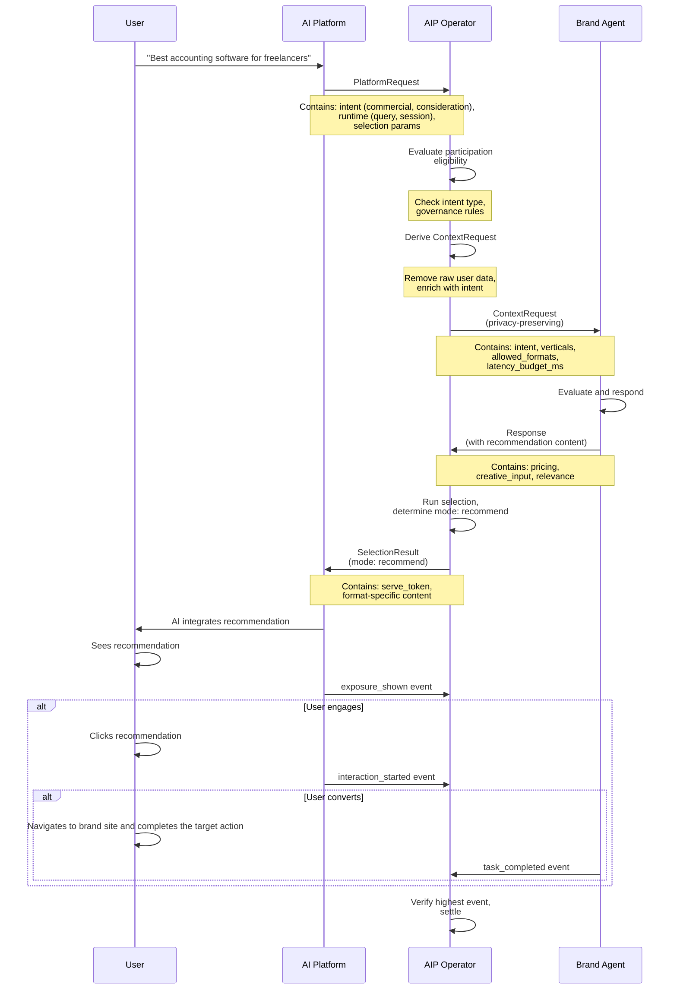
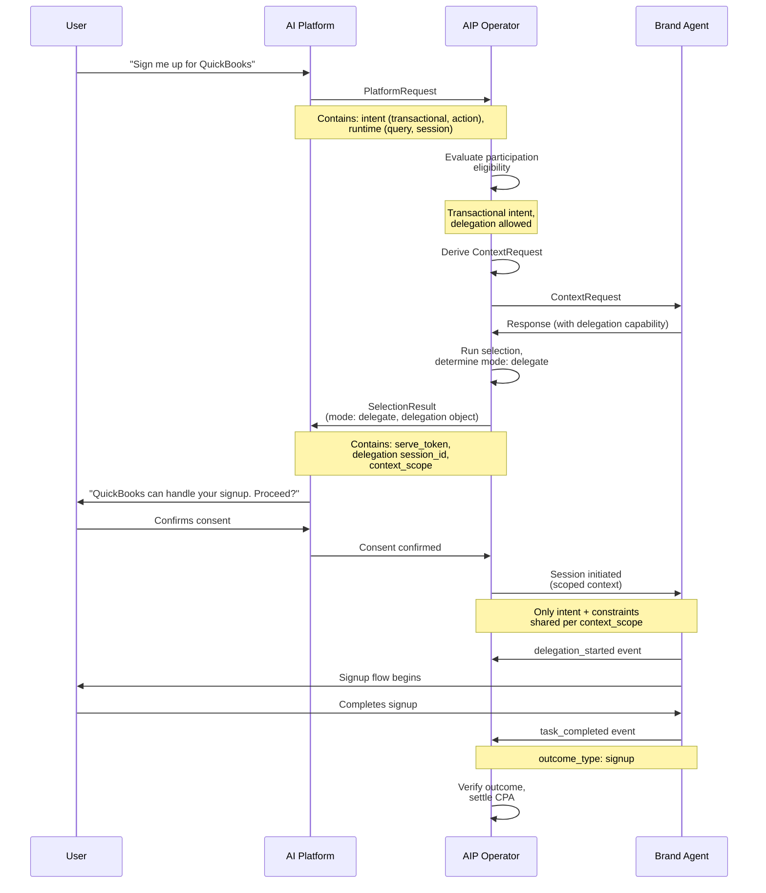

## Flow Overview

AIP connects AI Platforms, Operators, and Brand Agents through a series of request/response cycles, selection, and event verification. The protocol supports two distinct flows based on the interaction mode.

---

## Flow 1: Recommend Mode

Used when the user is researching, considering, or comparing options. The brand agent contributes to the AI response without any session transfer.


```mermaid
sequenceDiagram
    participant User
    participant Platform as AI Platform
    participant Operator as AIP Operator
    participant BrandAgent as Brand Agent

    User->>Platform: "Best accounting software for freelancers"
    Platform->>Operator: PlatformRequest
    Note over Platform,Operator: Contains: intent (commercial, consideration),<br/>runtime (query, session),<br/>selection params

    Operator->>Operator: Evaluate participation<br/>eligibility
    Note over Operator: Check intent type,<br/>governance rules

    Operator->>Operator: Derive ContextRequest
    Note over Operator: Remove raw user data,<br/>enrich with intent

    Operator->>BrandAgent: ContextRequest<br/>(privacy-preserving)
    Note over Operator,BrandAgent: Contains: intent, verticals,<br/>allowed_formats,<br/>latency_budget_ms

    BrandAgent->>BrandAgent: Evaluate and respond
    BrandAgent->>Operator: Response<br/>(with recommendation content)
    Note over BrandAgent,Operator: Contains: pricing,<br/>creative_input, relevance

    Operator->>Operator: Run selection,<br/>determine mode: recommend
    Operator->>Platform: SelectionResult<br/>(mode: recommend)
    Note over Operator,Platform: Contains: serve_token,<br/>format-specific content

    Platform->>User: AI integrates recommendation

    User->>User: Sees recommendation
    Platform->>Operator: exposure_shown event

    alt User engages
        User->>User: Clicks recommendation
        Platform->>Operator: interaction_started event

        alt User converts
        User->>User: Navigates to brand site and completes the target action
        BrandAgent->>Operator: task_completed event
        end
    end

    Operator->>Operator: Verify highest event,<br/>settle
```

### Recommend flow summary

1. User asks a question with commercial intent
2. Platform sends PlatformRequest to Operator
3. Operator evaluates participation eligibility  -  allowed
4. Operator derives ContextRequest and sends to eligible brand agents
5. Brand agents respond with pricing and content
6. Operator runs selection, determines recommend mode
7. Platform receives SelectionResult and integrates recommendation into AI response
8. Events track the lifecycle: exposure_shown → interaction_started → task_completed
9. Only the highest-value event is settled

---

## Flow 2: Delegate Mode

Used when the user has transactional intent and is ready to act. The AI hands off the session to a brand agent for task execution.


```mermaid
sequenceDiagram
    participant User
    participant Platform as AI Platform
    participant Operator as AIP Operator
    participant BrandAgent as Brand Agent

    User->>Platform: "Sign me up for QuickBooks"
    Platform->>Operator: PlatformRequest
    Note over Platform,Operator: Contains: intent (transactional, action),<br/>runtime (query, session)

    Operator->>Operator: Evaluate participation<br/>eligibility
    Note over Operator: Transactional intent,<br/>delegation allowed

    Operator->>Operator: Derive ContextRequest
    Operator->>BrandAgent: ContextRequest
    BrandAgent->>Operator: Response (with delegation capability)

    Operator->>Operator: Run selection,<br/>determine mode: delegate
    Operator->>Platform: SelectionResult<br/>(mode: delegate, delegation object)
    Note over Operator,Platform: Contains: serve_token,<br/>delegation session_id,<br/>context_scope

    Platform->>User: "QuickBooks can handle your signup. Proceed?"
    User->>Platform: Confirms consent
    Platform->>Operator: Consent confirmed

    Operator->>BrandAgent: Session initiated<br/>(scoped context)
    Note over Operator,BrandAgent: Only intent + constraints<br/>shared per context_scope

    BrandAgent->>Operator: delegation_started event
    BrandAgent->>User: Signup flow begins

    User->>BrandAgent: Completes signup
    BrandAgent->>Operator: task_completed event
    Note over BrandAgent,Operator: outcome_type: signup

    Operator->>Operator: Verify outcome,<br/>settle CPA
```

### Delegate flow summary

1. User expresses transactional intent
2. Platform sends PlatformRequest to Operator
3. Operator evaluates eligibility  -  delegation is allowed
4. Operator derives ContextRequest and sends to eligible agents
5. Brand agent responds with delegation capability
6. Operator runs selection, determines delegate mode
7. Platform receives SelectionResult with delegation object
8. Platform asks user for consent
9. User consents  -  session handed off to brand agent with scoped context
10. Brand agent executes the task
11. `task_completed` event fired and verified
12. Operator settles CPA

---

## 1. Platform Request (AI Platform → Operator)

**Schema:** [`platform-request.json`](/schemas/platform-request)

The AI platform initiates the process by sending a `PlatformRequest` to the operator. The operator validates the request (signature, platform `aip.json`, and match of `editorial_domains` vs `extensions.aip.intent`); if eligible, it derives a **ContextRequest** and sends it to brand agents.

### Key fields:
- `spec_version`: AIP request schema version (e.g. "1.0")
- `message_id`: Unique identifier for this request
- `timestamp`: ISO 8601 timestamp
- `producer`: Producer information; **`agent_role` must be `"platform"`**
- `context`: Context (language, publisher, placement, device, geography)
- `identity`: Identity (namespace, value_hash, confidence)
- `extensions.aip.intent`: **Required.** Platform-declared intent (domain, subdomain, confidence) for participation governance
- `extensions.aip.runtime`: **Required.** session_id, turn_index, query_text, optional messages, latency_budget_ms
- `extensions.aip.selection`: Optional. pricing_model, cpx_floor, currency

### Example:
```json
{
  "spec_version": "1.0",
  "message_id": "req_92fA1",
  "timestamp": "2025-11-14T18:22:00Z",
  "producer": {
    "agent_id": "openai_chat",
    "agent_role": "platform",
    "software": "chatgpt",
    "software_version": "4.3-mini"
  },
  "context": {
    "language": "en-US",
    "publisher": "openai_chat",
    "placement": { "unit": "conversation" },
    "device": { "platform": "web", "form_factor": "desktop", "ua_hash": "ua_hash_xyz" },
    "geography": { "country": "US" }
  },
  "identity": {
    "namespace": "platform_user",
    "value_hash": "user_hash_abc123",
    "confidence": 1.0
  },
  "extensions": {
    "aip": {
      "intent": { "domain": "business", "subdomain": "crm", "confidence": 0.91 },
      "runtime": {
        "session_id": "sess_001",
        "turn_index": 3,
        "query_text": "best CRM for small teams",
        "messages": [
          { "role": "user", "content": "best CRM tools?" },
          { "role": "assistant", "content": "HubSpot, Zoho, Salesforce…" }
        ],
        "latency_budget_ms": 500
      },
      "selection": { "pricing_model": "CPX", "cpx_floor": 0.05, "currency": "USD" }
    }
  }
}
```

---

## 2. Context Request (Operator → Brand Agents)

**Schema:** [`context-request.json`](/schemas/context-request)

The operator normalizes the platform request and enriches it with intent analysis, then sends a `ContextRequest` to brand agents.

### Key fields:
- `spec_version`: AIP specification version (default: "1.0")
- `message_id`: Unique identifier (maps to PlatformRequest message_id)
- `timestamp`: ISO 8601 timestamp
- `producer`: Producer information (from PlatformRequest)
- `session_id`: Conversation or interaction session ID
- `turn_index`: Turn index in the conversation
- `context_id`: Unique ID for this selection request
- `language`: User locale in BCP 47 format
- `intent`: Operator-generated semantic understanding
  - `type`: "informational" | "commercial" | "transactional"
  - `decision_phase`: "research" | "compare" | "decide" | "act"
  - `confidence`: Confidence score (0.0-1.0)
  - `summary`: Short summary of conversation context
- `verticals`: Normalized topical verticals
- `allowed_formats`: Content formats allowed
- `latency_budget_ms`: Platform latency budget in milliseconds

### Example:
```json
{
  "spec_version": "1.0",
  "message_id": "req_92fA1",
  "timestamp": "2025-11-14T18:22:00Z",
  "producer": {
    "agent_id": "openai_chat",
    "agent_role": "platform",
    "software": "chatgpt",
    "software_version": "4.3-mini"
  },
  "session_id": "sess_001",
  "turn_index": 3,
  "latency_budget_ms": 500,
  "allowed_formats": ["weave", "tail", "product_card"],
  "context_id": "ctx_92fA1",
  "language": "en-US",
  "intent": {
    "type": "commercial",
    "decision_phase": "compare",
    "confidence": 0.87,
    "summary": "User is evaluating CRM tools and narrowing down options."
  },
  "verticals": ["crm", "smb_software"]
}
```

---

## Selection window and timing

AIP uses a time-bounded selection window to ensure low latency and predictable outcomes.

* The selection window is derived from the PlatformRequest `latency_budget_ms` field
* The Operator computes the available response window by subtracting operator overhead from the platform's latency budget
* The window begins when the ContextRequest is published
* Brand agents MUST submit responses before the computed window expires
* If `latency_budget_ms` is not provided, the Operator MUST apply a default fallback

If the window expires with no responses, the outcome is `no_match`. Late responses are ignored.

---

## 3. Brand Agent Response (Brand Agents → Operator)

**Schema:** [`bid.json`](/schemas/bid)

Brand agents evaluate the context request and submit responses containing pricing and content.

### Key fields:
- `bid_id`: Unique identifier for this response
- `brand_agent_id`: Identifier of the brand agent
- `context_id`: ID of the ContextRequest being responded to
- `wallet_id`: Wallet to debit if selected
- `pricing`: Pricing vector with micros (authoritative), cents (display), and dollars (UI)
- `recommendation.creative_input`: Unified content structure
- `relevance`: Relevance score (0.0-1.0, required)
- `supports_delegation`: Whether this agent supports delegate mode (optional)

### Example:
```json
{
  "bid_id": "bid_7823",
  "brand_agent_id": "brand_agent_123",
  "context_id": "ctx_92f",
  "wallet_id": "wallet_890",
  "pricing": {
    "currency": "USD",
    "display_currency": "USD",
    "cpx_micros": 50000,
    "cpx_cents": 5,
    "cpx_dollars": 0.05,
    "cpc_micros": 450000,
    "cpc_cents": 45,
    "cpc_dollars": 0.45,
    "cpa_micros": 10000000,
    "cpa_cents": 1000,
    "cpa_dollars": 10.0,
    "preferred_pricing_model": "CPA"
  },
  "recommendation": {
    "creative_input": {
      "brand_name": "Nimbus",
      "product_name": "Nimbus CRM Pro",
      "short_description": "CRM built for growing teams, with AI-assisted workflows.",
      "long_description": "Nimbus CRM Pro is designed for teams of 5-50 people who need intelligent pipeline management.",
      "value_props": [
        "Automated pipeline insights",
        "Collaborative forecasting"
      ],
      "context_snippet": "For startups needing higher limits and automated expense workflows.",
      "cta_label": "Start Free Trial",
      "cta_url": "https://nimbus.example.com/signup"
    }
  },
  "timestamp": "2025-11-11T18:00:01Z",
  "relevance": 0.87,
  "supports_delegation": true
}
```

---

## 4. PlatformResponse (Operator → AI Platform)

The operator evaluates the auction and returns a `PlatformResponse` to the AI platform.

### Key fields:
- `response_id`: Unique identifier for this response
- `serve_token`: Token used to track downstream events
- `status`: Outcome status (`filled`, `no_fill`, `error`)
- `winner`: Winning bid state, pricing, and billing reservation
- `render`: Structured render payload for platform presentation
- `delegation`: Optional delegation availability for the winning bid
- `ttl_ms`: Time-to-live in milliseconds

### Example (recommend mode):
```json
{
  "spec_version": "1.0",
  "response_id": "resp_981",
  "auction_id": "auc_981",
  "serve_token": "stk_abcxyz123",
  "timestamp": "2026-03-26T18:00:02Z",
  "status": "filled",
  "winner": {
    "bid_id": "bid_7823",
    "brand_agent_id": "ba_451",
    "pricing": {
      "model": "CPA",
      "price_micros": 10000000,
      "currency": "USD"
    },
    "billing": {
      "reserved_amount_micros": 500000000,
      "currency": "USD"
    }
  },
  "render": {
    "format": "weave",
    "disclosure": "[Ad]",
    "creative": {
      "advertiser": {
        "brand_name": "Nimbus"
      },
      "ad_assets": {
        "headline": "Scale your CRM",
        "description": "Built for founders.",
        "cta_text": "Try for free"
      },
      "landing_page_url": "https://nimbus.example.com/signup",
      "click_url": "https://admesh.click/stk_abcxyz123"
    }
  },
  "delegation": {
    "available": true,
    "mode": "optional",
    "trigger": "user_action",
    "cta_text": "Continue with Nimbus"
  },
  "ttl_ms": 60000
}
```

---

## 5. Events (Platform/Brand Agent → Operator)

After participation begins, events track the decision lifecycle.

### 5.1 Exposure shown

Sent when the user sees the recommendation or delegation offer.

```json
{
  "event_id": "evt_ps_001",
  "serve_token": "stk_abcxyz123",
  "event_type": "exposure_shown",
  "timestamp": "2025-11-14T18:22:05Z",
  "platform_id": "openai_chat",
  "session_id": "sess_001",
  "auth": {
    "nonce": "nonce_ps_123",
    "sig": "sig_ps_456"
  }
}
```

### 5.2 Interaction started

Sent when the user engages with the recommendation.

```json
{
  "event_id": "evt_is_001",
  "serve_token": "stk_abcxyz123",
  "event_type": "interaction_started",
  "timestamp": "2025-11-14T18:22:10Z",
  "platform_id": "openai_chat",
  "session_id": "sess_001",
  "interaction_url": "https://admesh.click/stk_abcxyz123",
  "auth": {
    "nonce": "nonce_is_123",
    "sig": "sig_is_456"
  }
}
```

### 5.3 Delegation started

Sent when the user consents and a session is handed off (delegate mode only).

```json
{
  "event_id": "evt_ds_001",
  "serve_token": "stk_abcxyz123",
  "event_type": "delegation_started",
  "timestamp": "2025-11-14T18:22:15Z",
  "platform_id": "openai_chat",
  "session_id": "sess_001",
  "delegation_session_id": "del_sess_001",
  "agent_id": "ba_451",
  "auth": {
    "nonce": "nonce_ds_123",
    "sig": "sig_ds_456"
  }
}
```

### 5.4 Task completed

Sent when the user completes the target action.

```json
{
  "event_id": "evt_tc_001",
  "serve_token": "stk_abcxyz123",
  "event_type": "task_completed",
  "timestamp": "2025-11-14T18:25:00Z",
  "platform_id": "openai_chat",
  "session_id": "sess_001",
  "outcome_type": "signup",
  "outcome_value_cents": 0,
  "auth": {
    "nonce": "nonce_tc_123",
    "sig": "sig_tc_456"
  }
}
```

---

## Schema relationships

| Schema | Used In | Purpose |
|--------|---------|---------|
| `platform-request` | AI Platform → Operator | Initial participation request |
| `context-request` | Operator → Brand Agents | Eligible participation context |
| `bid` | Brand Agents → Operator | Response with pricing and content |
| `selection-result` | Operator → AI Platform | Selected agent + interaction mode |

---

## Key identifiers flow

```
message_id (PlatformRequest)
    ↓
context_id (ContextRequest) ← maps to message_id
    ↓
bid_id (Response) ← references context_id
    ↓
response_id (PlatformResponse) ← references context_id
    ↓
serve_token (PlatformResponse) ← used in all events
    ↓
event_id (Events) ← references serve_token
    ↓
ledger_id (Settlement record) ← references event_id, bid_id, context_id
```

---

## Common patterns

### Authentication
All requests include an `auth` object with:
- `nonce`: One-time nonce for replay protection
- `sig` or `signature`: HMAC signature of the request

### Timestamps
All timestamps use ISO 8601 / RFC 3339 format:
- Format: `YYYY-MM-DDTHH:mm:ssZ`
- Example: `2025-11-14T18:22:00Z`

### Money/Currency
- Prices in `pricing` object: Decimal strings (e.g., `"0.05"`)
- Amounts in events/settlement: Integer cents (e.g., `5` for $0.05)
- Currency: ISO 4217 code (e.g., `"USD"`)

### IDs
- Platform-generated: `req_*`, `sess_*`, `user_*`
- Operator-generated: `ctx_*`, `sel_*`, `stk_*`
- Brand Agent-generated: `bid_*`
- Event-generated: `evt_*`
- System-generated: `ledger_*`, `wallet_*`
