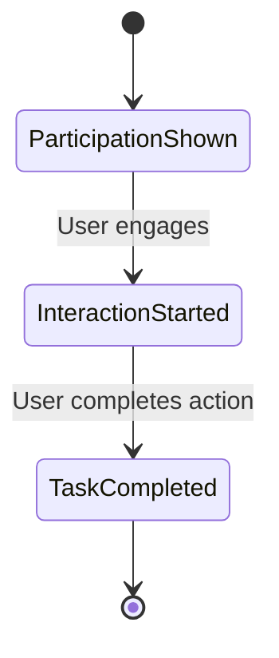
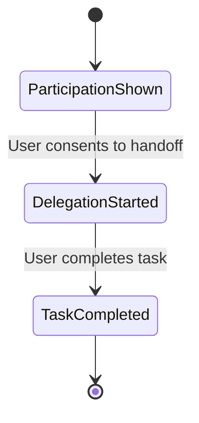

Every measurable action in AIP is recorded as an **Event**.
AIP measures the lifecycle of a decision, not just isolated interactions.

---

## 1. TL;DR

> Events track and verify each stage of the decision lifecycle: participation, interaction, delegation, and outcome.

---

## 2. Why it matters

Traditional systems rely on opaque tracking pixels and fragmented attribution.
AIP replaces those with **signed, timestamped events** tied to a single `serve_token` that can be independently verified by all participants.

This means:
- No duplicate billing
- No fabricated interactions
- Transparent proof of every settled action
- Full lifecycle visibility from participation to outcome

---

## 3. Decision lifecycle events

AIP defines four progressive event stages  -  each building on the last.
Only **the highest-value event** in a lifecycle is billable per `serve_token`.

| Event | Type | Trigger | Settlement Unit | Mode |
|-------|------|---------|----------------|------|
| **Exposure shown** | `exposure_shown` | Commercial response surfaced to user | CPX | Both |
| **Interaction started** | `interaction_started` | User engaged with recommendation | CPE or CPC | Both |
| **Delegation started** | `delegation_started` | Session handoff initiated |  -  | Delegate only |
| **Task completed** | `task_completed` | User completed a signup, purchase, or action | CPA | Both |

Once a higher event (like `task_completed`) is verified, lower-tier events are not billed again.

| Metric | Meaning |
|--------|---------|
| `CPX` | Cost per Exposure |
| `CPE` | Cost per Engagement |
| `CPC` | Cost per Click |
| `CPA` | Cost per Action |

---

## 4. Event lifecycle

### Recommend mode



### Delegate mode



Each transition is verified and timestamped.
If no further event occurs, the lifecycle ends at the last verified state.

---

## 5. EventPacket schema

All events share common required fields that link them back to the selection and enable verification.

### Common required fields

| Field | Type | Description |
|--------|------|-------------|
| `event_type` | string | Event type identifier (`exposure_shown`, `interaction_started`, `delegation_started`, or `task_completed`) |
| `serve_token` | string | Serve token from the selection result  -  links event to original selection |
| `ts` | string | ISO 8601 timestamp of when the event occurred |

### Event-specific fields

At the protocol level, events require `event_type`, `serve_token`, and `timestamp`. Each event type has additional required and optional fields that are implementation-specific.

### Example: Exposure shown event

```json
{
  "event_type": "exposure_shown",
  "serve_token": "stk_abcxyz123",
  "session_id": "s_001",
  "platform_id": "pf_chatapp",
  "agent_id": "ag_123",
  "wallet_id": "w_890",
  "settlement": {
    "unit": "CPX",
    "amount": "0.034",
    "currency": "USD"
  },
  "ts": "2025-11-11T18:00:00Z"
}
```

### Example: Delegation started event

```json
{
  "event_type": "delegation_started",
  "serve_token": "stk_abcxyz123",
  "session_id": "sess_789",
  "platform_id": "pf_chatapp",
  "agent_id": "ag_123",
  "delegation_session_id": "del_sess_001",
  "ts": "2025-11-11T18:01:00Z"
}
```

### Example: Task completed event

```json
{
  "event_type": "task_completed",
  "serve_token": "stk_abcxyz123",
  "session_id": "sess_789",
  "platform_id": "pf_chatapp",
  "agent_id": "ag_123",
  "outcome_type": "signup",
  "outcome_value_cents": 0,
  "settlement": {
    "unit": "CPA",
    "amount": "10.00",
    "currency": "USD"
  },
  "ts": "2025-11-11T18:30:00Z"
}
```

The `serve_token` links each event back to the original selection and selected agent.

---

## 6. Verification process

Operators define their own verification logic for each event type. Acceptable signal sources include:

| Event Type | Signal Sources (Informational) |
|------------|-------------------------------|
| **Exposure shown** | Platform display logs, visibility events, viewability metrics |
| **Interaction started** | Platform interaction logs, user engagement events, timestamp validation |
| **Delegation started** | Operator session records, brand agent session confirmation |
| **Task completed** | Brand agent callbacks, server-side API confirmations, outcome tracking |

Every event is digitally signed and validated against the original `serve_token`. Operators implement their own verification and reconciliation logic to ensure event integrity.

---

## 7. Example flow

### Recommend mode
1. Platform renders a commercial recommendation → **exposure_shown logged**
2. User clicks the recommendation → **interaction_started verified**
3. User signs up on brand's site → **task_completed confirmed**
4. Lower events (exposure_shown, interaction_started) are marked as verified but not billed

### Delegate mode
1. Platform shows delegation offer → **exposure_shown logged**
2. User consents, session handed off → **delegation_started verified**
3. User completes signup through brand agent → **task_completed confirmed**
4. Only task_completed (CPA) is billed

---

## 8. Settlement implications

Operators determine settlement based on verified events according to the event lifecycle:

**Settlement rule:** Only the highest-value event in a lifecycle is billable.

| Highest verified event | What is billed |
|----------------------|----------------|
| `task_completed` | CPA |
| `interaction_started` | CPC |
| `delegation_started` | Operator-defined |
| `exposure_shown` | CPX |

Settlement terms, revenue sharing, and payout schedules are defined by each operator's policies and agreements with platforms and brand agents.

---

## 9. Guarantees

- Each event is uniquely linked to a serve token
- Events cannot be duplicated or retroactively modified
- Signatures are auditable by any party in the chain
- Settlement data is mathematically verifiable
- Only the highest-value event per lifecycle is billable

---

## Summary

> Events are the backbone of AIP  -  they turn user decisions into verified, auditable, and settled outcomes across the full participation lifecycle.
