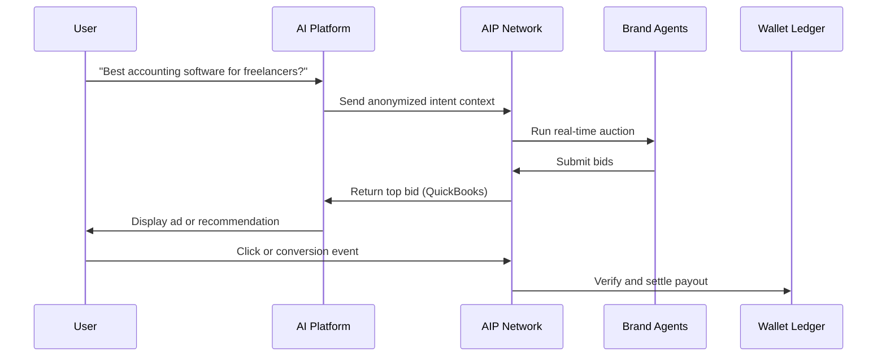

## The new standard for monetizing AI intent

AIP is an **open protocol** that lets AI platforms and advertisers **transact on verified user intent**, not just impressions or clicks.  
It defines how AI systems, agents, and advertisers exchange context, bids, and verified outcomes in a transparent way.

---

## Why AIP exists

AI conversations reveal what users actually want, their **intent**.  
Until now, there has been no common way to connect that intent with advertisers or measure it fairly.

AIP solves this by standardizing how intent is:

- Captured from AI platforms  
- Matched with brand agents  
- Verified when a user engages or converts  
- Settled transparently through wallets and ledgers  

---

## What AIP standardizes

| Layer | What it does | Why it matters |
|-------|---------------|----------------|
| **Context Ingestion** | Collects anonymized intent from AI platforms | Enables precise, privacy-safe matching |
| **Real-Time Auction** | Lets brand agents bid on verified intent | Creates market-based pricing for intent |
| **Event Verification** | Tracks CPX, CPC, and CPA outcomes with signatures | Prevents fraud and double charging |
| **Wallet Settlement** | Automates monthly payouts and auditing | Makes billing deterministic and trusted |

---

## Built-in guarantees

- One verified charge per event  
- Priority order: **CPA → CPC → CPX**  
- Signed and auditable ledger  
- Interoperable with any ad network  

---

## Who benefits

<Card title="AI Platforms">
Gain a sustainable monetization model without compromising user experience.
</Card>

<Card title="Advertisers">
Pay only for verified intent with transparent ROI.
</Card>

<Card title="Users">
See contextually relevant, trusted recommendations instead of noise.
</Card>

---

## Example: How it works

---

## AIP in one line

> **AIP turns AI intent into a trusted and monetizable signal for platforms, agents, and advertisers.**

---

## Get started

- [Overview](/overview)  
- [Quickstart for Platforms](/quickstart-platform)  
- [Quickstart for Brand Agents](/quickstart-agent)  