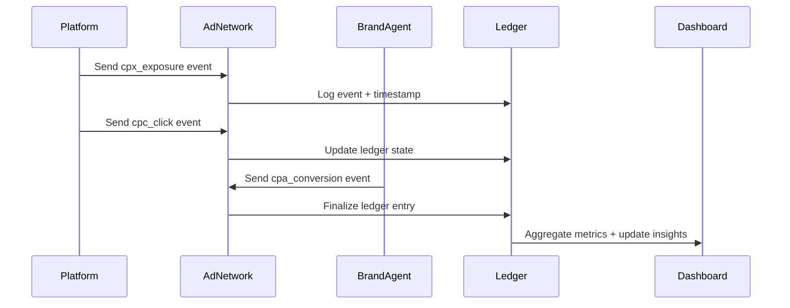

AIP is fully observable — every request, auction, and payout is tracked with verifiable metrics, logs, and audit trails.  
This allows platforms, ad networks, and brand agents to monitor performance and trust that every event is accounted for.

---

## 1. TL;DR

> Observability in AIP means every transaction is measurable, traceable, and verifiable — from user intent to payout.

---

## 2. Why it matters

Traditional ad systems are opaque: data is hidden behind dashboards, and reconciliation happens weeks later.  
AIP fixes this by exposing **real-time telemetry and audit logs** that prove what happened, when, and why.

This transparency:
- Builds trust between participants  
- Simplifies troubleshooting  
- Enables continuous optimization  

---

## 3. Observability Layers

| Layer | What It Tracks | Used By |
|-------|----------------|---------|
| **Metrics** | Auction latency, bid volume, win rates, conversion ratios | Engineers & Data Teams |
| **Event Logs** | Exposure, click, and conversion confirmations | Platforms & Ad Networks |
| **Ledger Reports** | Payout and spend summaries | Finance & Operations |
| **Audit Trails** | Signature verification and replay defense logs | Compliance & Security |

---

## 4. Real-time Metrics

AIP exposes a `/metrics` endpoint (Prometheus compatible) for tracking live system health and bidding performance.

Example metrics:

```bash
aip_auction_latency_ms{adnetwork="admesh"} 120
aip_bid_volume_total{agent="brand_quickbooks"} 4821
aip_conversion_rate{platform="ai_chat"} 0.034
aip_verification_failures_total 3
```

All metrics are taggable by `platform_id`, `agent_id`, and `auction_id` for granular insights.

---

## 5. Event Logs

Each participant maintains an **immutable event log**:

```json
{
  "event_type": "cpc_click",
  "serve_token": "stk_abcxyz123",
  "event_id": "ev_991",
  "ts": "2025-11-12T02:15:00Z"
}
```

These logs can be streamed to:
- Cloud logging (Stackdriver, Datadog, CloudWatch)
- Internal monitoring dashboards
- AdMesh console for visual reporting

For complete event schemas, see:
- [CPX Exposure Event](/schemas/event-cpx)
- [CPC Click Event](/schemas/event-cpc)
- [CPA Conversion Event](/schemas/event-cpa)

---

## 6. Audit Ledger

The Ad Network’s **audit ledger** acts as the single source of truth.  
It tracks every signature, event hash, and verification step:

| Field | Description |
|--------|--------------|
| `serve_token` | Unique event chain identifier |
| `hash` | SHA256 of the event payload |
| `verified_at` | UTC timestamp of last check |
| `verifiers` | Entities that confirmed authenticity |
| `status` | Valid / Invalid / Pending |

This ledger is accessible via secure API endpoints for compliance and reconciliation.

---

## 7. Example Observability Flow



Every action — from click to payout — produces traceable logs that feed both live dashboards and monthly audit reports.

---

## 8. Privacy and Compliance

AIP’s observability layer is designed to **measure everything without exposing users**.  
All logged data is:
- **Anonymized** (no personal identifiers)  
- **Aggregated** for analytics  
- **Tamper-proof** via event hashing and timestamping  

This keeps the system transparent but privacy-safe.

---

## 9. Guarantees

- Every event and transaction is logged and verifiable.  
- Real-time metrics reflect true protocol performance.  
- Audit trails meet SOC 2 and ISO 27001 standards.  
- Logs are immutable and independently auditable.  

---

## Summary

> Observability turns AIP from a protocol into a living, measurable ecosystem — where every action is visible, auditable, and trusted.
