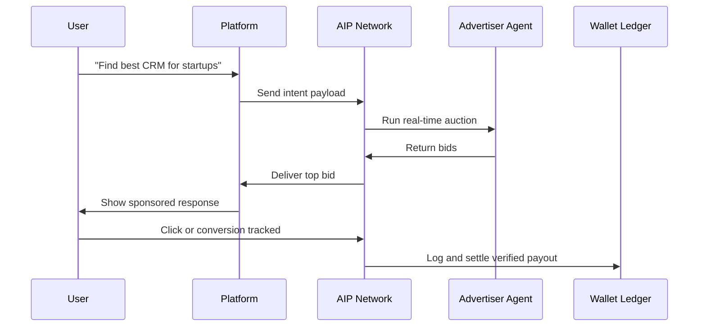

## What is AIP?
AIP converts user or agent intent into a **verified economic event** that platforms, advertisers, and networks can trust.  
It defines clear roles, event types, and settlement rules to make AI-native advertising measurable and interoperable.

---

## Core Roles

| Role | Description |
|------|--------------|
| **Platform** | Any AI surface that integrates the AdMesh SDK and sends anonymized intent data. |
| **Advertiser Agent** | A brand-owned or third-party bidding service that responds to verified intent. |
| **Operator** | Any ad network implementing the AIP standard. AdMesh is the reference operator. |

Each request in AIP flows between these three entities, ensuring full transparency and verified settlement.

---

## Event Ladder

AIP defines three progressive units of verified engagement.  
Only **one unit** can settle per serve token.

| Unit | Meaning | Trigger |
|------|----------|---------|
| **CPX (Exposure)** | User saw a verified recommendation | Exposure pixel fired |
| **CPC (Click)** | User clicked or engaged with the recommendation | Click event verified |
| **CPA (Conversion)** | User completed a transaction or signup | Conversion verified through callback or API |

A single exposure can upgrade to a click or a conversion, but lower tiers never double-bill once a higher unit is confirmed.

---

## Lifecycle of an AIP Event

---

## Verification and Settlement

Each AIP event carries a **serve token** that links all downstream actions.  
This ensures:
- One verified charge per event  
- No duplicate billing across tiers  
- Deterministic payout flow through connected wallets  

Monthly settlements occur through signed ledgers managed by the operator.  
All events are auditable and traceable by both platforms and advertisers.

---

## Transparency and Compliance

AIP is designed for verifiable advertising inside AI ecosystems:
- **Privacy-safe:** No user identifiers are shared.  
- **Verifiable:** Every event is cryptographically signed.  
- **Interoperable:** Works with any network that adopts the same schema.  
- **Auditable:** Logs can be inspected by all participants in the chain.  

---

## In summary

> AIP turns every qualified user intent into a trusted, auditable, and monetizable signal across the AI economy.

---

### Next steps

- [Protocol Basics](/protocol)  
- [Auction and Scoring](/auction)  
- [Wallets and Payouts](/wallets-and-payouts)  
- [JSON Schemas](/schemas/README)  
