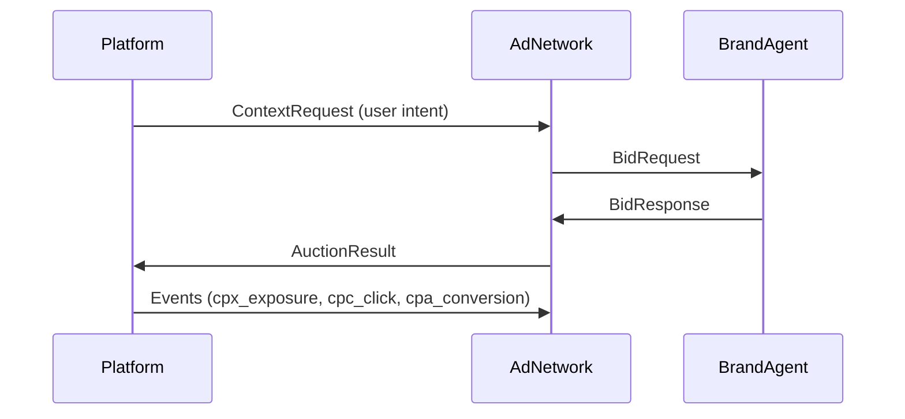

# Agentic Intent Protocol (AIP)

AIP defines a common language for how **AI Platforms**, **Ad Networks**, and **Brand Agents** talk to each other.  
It ensures every request, bid, and payout is traceable, secure, and verifiable.

---

## 1. TL;DR

> AIP is the communication layer that lets every intent, bid, and event move securely between participants.

---

## 2. Why it matters

Without a shared standard, every platform and advertiser would use different message formats.  
AIP replaces that chaos with one protocol that guarantees:
- Consistent data structures  
- Secure signatures and timestamps  
- Clear tracking from exposure to conversion  

This creates **trust** in every transaction.

---

## 3. How it works

Every AIP interaction follows a simple pattern:



Each message is signed, timestamped, and stored for verification.

---

## 3.1 PlatformRequest vs ContextRequest

- **PlatformRequest** – Sent by the AI platform to the operator; includes raw query text, optional message history, locale/geo, minimum CPX, and any namespaced metadata inside `ext`.
- **ContextRequest** – Derived by the operator from the PlatformRequest before it is fanned out to subscribed brand agents. Operators may redact, enrich, or reformat the data while keeping identifiers stable.

This split keeps the platform/operator contract predictable while allowing operators to tailor what bidders see.

---

## 4. Transport and Security

All requests use **HTTPS or gRPC** for transport.  
Each message includes a cryptographic signature header:

```
X-AIP-Signature: HMAC(method + path + body + timestamp + nonce)
X-AIP-Version: 0.1
```

This prevents tampering, replay attacks, or duplicate submissions.

**Timestamps:** RFC 3339 (UTC)  
**Nonces:** Unique per request  
**Versioning:** Declared in header to ensure backward compatibility.

---

## 5. Identifiers

AIP uses a set of consistent IDs to trace every step of the transaction.

| Identifier | Purpose |
|-------------|----------|
| `platform_id` | Identifies the AI Platform |
| `agent_id` | Identifies the Brand Agent |
| `adnetwork_id` | Identifies the Ad Network |
| `wallet_id` | Linked to payout accounts |
| `session_id` | Groups user activity |
| `auction_id` | Tracks a single bidding event |
| `bid_id` | Tracks an individual bid |
| `serve_token` | Unique ID that binds exposure, click, and conversion |

These identifiers make AIP fully auditable end-to-end.

---

## 6. Example flow

1. User asks: “Best project management tool?”
2. Platform sends a `ContextRequest` to the Ad Network.
3. The Ad Network forwards it to Brand Agents.
4. Brand Agents bid with JSON responses.
5. The highest-scoring bid becomes the `AuctionResult`.
6. Platform displays it with a disclosure label `[Ad]`.
7. Exposures, clicks, and conversions are logged under one `serve_token`.

---

## 7. Guarantees

- Every message is signed and timestamped.  
- No two serve tokens collide.  
- All events can be independently verified by participants.  
- Protocol versioning ensures upgrades never break compatibility.

---

## Summary

> AIP provides the reliable transport, identifiers, and security foundation that make the entire ad ecosystem interoperable.
