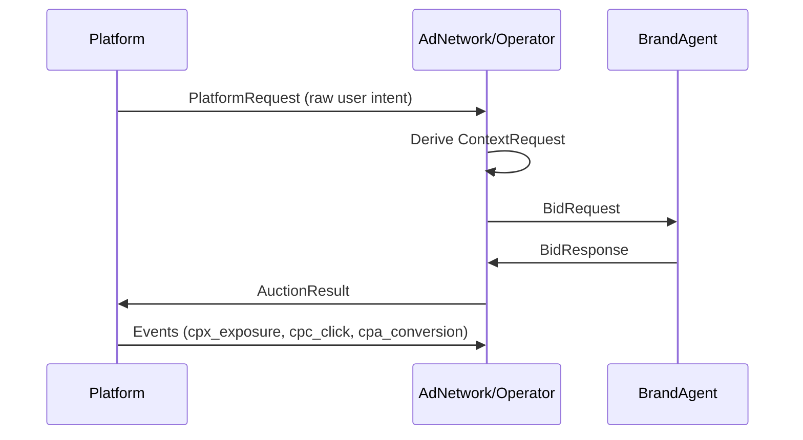

# Agentic Intent Protocol (AIP)

AIP defines a common language for how **AI Platforms**, **Operators (Ad Networks)**, and **Brand Agents** communicate.  
It ensures every request, bid, and payout is traceable, secure, and verifiable.

## 1. TL;DR

> AIP is the communication layer that lets every intent, bid, and event move securely between participants.

## 2. Why it matters

Without a shared standard, each platform and advertiser would need separate integrations.  
AIP replaces that fragmentation with one protocol that guarantees:

- Predictable message formats  
- Cryptographically signed requests  
- End-to-end tracking from exposure to conversion  

This creates **trust** and **interoperability** across the agentic ad ecosystem.

## 3. How it works



## 3.1 PlatformRequest vs ContextRequest

### PlatformRequest → Operator
Sent directly by the AI platform. Uses UCP (User Context Protocol) format with nested objects (producer, context, identity, extensions). Contains:

- Raw user query text  
- Optional message history  
- Locale and geo  
- CPX floor  
- metadata.* fields  

### ContextRequest → Brand Agents
Generated by the operator. Uses a UCP-like format with enriched context fields. Operators may normalize, enrich, or redact.  
This keeps platform→operator stable while giving operators flexibility.

## 4. Transport and Security

All messages use HTTPS or gRPC.  
Requests include secure headers:

```
X-AIP-Signature: HMAC(method + path + body + timestamp + nonce)
X-AIP-Version: 0.1
```

## 5. Identifiers

| Identifier | Purpose |
|-----------|----------|
| platform_id | AI Platform |
| agent_id | Brand Agent |
| adnetwork_id | Operator |
| wallet_id | Billing |
| session_id | User session |
| auction_id | Auction |
| bid_id | Bid |
| serve_token | Exposure → click → conversion |

## 6. Example flow

1. User asks: “Best project management tool?”
2. Platform sends PlatformRequest.
3. Operator derives ContextRequest.
4. Brand Agents bid.
5. Operator returns AuctionResult.
6. Platform displays `[Ad]`.
7. Events logged under serve_token.

## 7. Guarantees

- Signed, timestamped messages  
- No serve-token collisions  
- Independent verification  
- Safe version upgrades  

## Summary

> AIP provides the transport, identifiers, and verification layer for agentic advertising.
