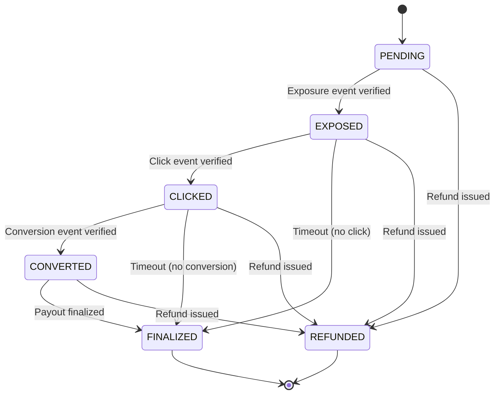

The **State Machine** defines protocol-level constraints on how a `serve_token` may transition through states — exposure, click, and conversion.  
It ensures each `serve_token` transitions in one direction only, making billing and verification deterministic. Operators implement their own state handling logic as long as these protocol guarantees are met.

---

## 1. TL;DR

> The AIP state machine defines allowed state transitions and invariants for ad lifecycle tracking, ensuring no event is double-counted or reversed. Operators implement their own detection, verification, and enforcement logic.

---

## 2. Why it matters

In legacy ad systems, duplicate exposures, repeated clicks, or delayed conversions often lead to inaccurate billing.  
AIP eliminates this by defining **protocol-level state constraints** — each serve token can only exist in one state at a time, with defined allowed transitions.

This makes every transaction:
- Verifiable  
- Reproducible  
- Auditable

Operators implement their own state management systems as long as they respect these protocol constraints.  

---

## 3. State diagram



Each state represents a **billing condition**.
The protocol guarantees that once a token moves forward, it cannot regress (e.g., a converted ad cannot revert to "clicked"). Operators implement their own state detection and transition logic to enforce these constraints.

---

## 4. State transitions

The protocol defines allowed transitions and constraints. Operators implement their own detection, verification, and enforcement logic.

| From | To | Trigger | Verification Responsibility |
|------|----|----------|---------------------------|
| PENDING | EXPOSED | `cpx_exposure` event | Operator (may use platform signals) |
| EXPOSED | CLICKED | `cpc_click` event | Operator (may use platform and network signals) |
| CLICKED | CONVERTED | `cpa_conversion` event | Operator (may use brand agent and network signals) |
| EXPOSED | FINALIZED | Operator-defined expiration or attribution window | Operator |
| CLICKED | FINALIZED | Operator-defined expiration or attribution window | Operator |
| CONVERTED | FINALIZED | Operator-defined settlement processing | Operator |
| Any State | REFUNDED | Operator-defined refund or reversal action | Operator |

AIP does not mandate specific time windows. Operators define their own expiration and attribution windows for state transitions. The protocol only guarantees that:
- Transitions are one-directional
- No regression once a higher state is reached
- At most one billable terminal state per `serve_token`

---

## 5. Example lifecycle

1. Auction completes, `serve_token` generated → state = *PENDING*
2. Operator verifies an **exposure** event → state = *EXPOSED*
3. Operator verifies a **click** event → state = *CLICKED*
4. Operator verifies a **conversion** event → state = *CONVERTED*
5. Operator finalizes settlement → state = *FINALIZED*

Each transition is timestamped and recorded according to operator-defined ledger policies.

---

## 6. How it prevents double billing

The protocol constrains allowed transitions:
- Two exposures for the same token cannot both transition the state forward.  
- A click without prior exposure state is not a valid transition.  
- A conversion without a verified click state is not a valid transition.  

Operators implement their own logic to detect and enforce these constraints, ensuring **billing integrity** and **logical consistency**.

---

## 7. Ledger integration

Operators maintain ledgers that record state transitions and final states, ensuring:
- Immutable event chains
- Deterministic reconciliation
- Verified payout records

The protocol guarantees that finalized states are immutable. Operators define their own ledger structure and settlement policies.

```json
{
  "serve_token": "stk_abcxyz123",
  "session_id": "s_001",
  "platform_id": "pf_chatapp",
  "agent_id": "ag_123",
  "auction_id": "auc_981",
  "state": "FINALIZED",
  "final_unit": "CPA",
  "final_charge": "10.00",
  "currency": "USD",
  "timestamps": {
    "auction": "2025-11-11T18:00:00Z",
    "exposure": "2025-11-11T18:00:00Z",
    "click": "2025-11-11T18:02:00Z",
    "conversion": "2025-11-11T18:30:00Z",
    "finalized": "2025-11-11T19:00:00Z"
  }
}
```

---

## 8. Guarantees

The protocol guarantees:
- State transitions are one-directional and irreversible.  
- No regression once a higher state is reached.  
- At most one billable terminal state per `serve_token`.  
- Finalized states are immutable and audit-safe.

Operators implement their own logic for detecting transitions, verifying events, handling expiration windows, and processing refunds or reversals.

---

## Summary

> The AIP state machine defines protocol-level constraints that ensure a single source of truth for every ad — preventing duplicates, enforcing fairness, and keeping the ecosystem financially clean. Operators implement their own state management systems to enforce these constraints.
