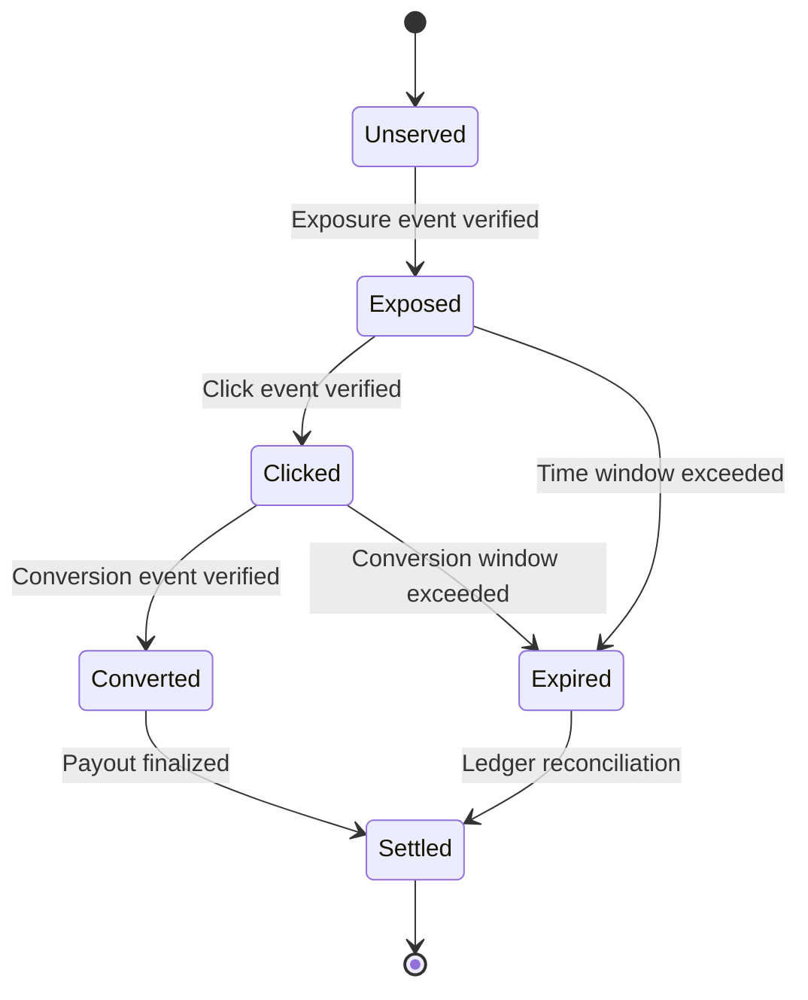

The **State Machine** defines how an ad moves through verified stages of engagement — exposure, click, and conversion.  
It ensures each `serve_token` transitions in one direction only, making billing and verification deterministic.

---

## 1. TL;DR

> The AIP state machine controls how an ad progresses from exposure to conversion, ensuring no event is double-counted or reversed.

---

## 2. Why it matters

In legacy ad systems, duplicate impressions, repeated clicks, or delayed conversions often lead to inaccurate billing.  
AIP eliminates this by applying **finite state logic** — each serve token can only exist in one state at a time, with defined transitions.

This makes every transaction:
- Verifiable  
- Reproducible  
- Auditable  

---

## 3. State diagram



Each state represents a **billing condition**.  
Once a token moves forward, it cannot regress (e.g., a converted ad cannot revert to “clicked”).

---

## 4. State transitions

| From | To | Trigger | Verified By |
|------|----|----------|--------------|
| Unserved | Exposed | `exposure` event | Platform |
| Exposed | Clicked | `click` event | Platform + Ad Network |
| Clicked | Converted | `conversion` event | Brand Agent + Ad Network |
| Exposed/Clicked | Expired | Timeout reached | Ad Network |
| Converted/Expired | Settled | Ledger processed | Ad Network |

AIP defines strict expiration windows:
- **Exposure → Click:** 30 minutes  
- **Click → Conversion:** 24 hours  
- **Settlement:** Once per billing cycle  

---

## 5. Example lifecycle

1. User query triggers a winning `serve_token`.  
2. Platform logs an **exposure** → state = *Exposed*  
3. User clicks the ad → state = *Clicked*  
4. User completes signup → state = *Converted*  
5. At the end of the month → state = *Settled*  

Each transition is cryptographically signed and appended to the ledger.

---

## 6. How it prevents double billing

Because every event must follow a defined transition:
- Two exposures for the same token are ignored.  
- A click without prior exposure is invalid.  
- A conversion without a verified click is rejected.  

This guarantees **billing integrity** and **logical consistency** across all participants.

---

## 7. Ledger integration

Every final state is logged to the **Ad Network ledger**, ensuring:
- Immutable event chains  
- Deterministic reconciliation  
- Verified payout records  

```json
{
  "serve_token": "srv_20381f",
  "final_state": "Converted",
  "verified_by": ["Platform", "AdNetwork", "BrandAgent"],
  "settled_at": "2025-11-30T00:00:00Z"
}
```

---

## 8. Guarantees

- State transitions are one-directional and irreversible.  
- Each transition is signed by at least one verifier.  
- Expired states auto-close for settlement.  
- Finalized ledgers are immutable and audit-safe.

---

## Summary

> The AIP state machine enforces a single source of truth for every ad — preventing duplicates, enforcing fairness, and keeping the ecosystem financially clean.

Next: [Wallets and Payouts](/wallets-and-payouts)
