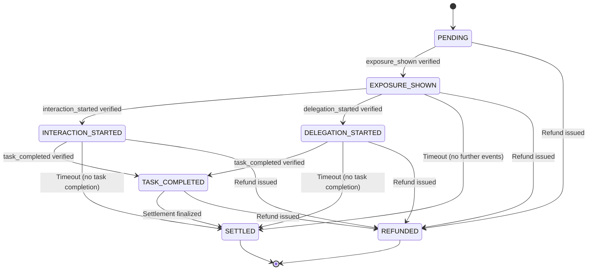

The **State Machine** defines protocol-level constraints on how a `serve_token` may transition through states  -  from participation through outcome and settlement.
It ensures each `serve_token` transitions in one direction only, making settlement and verification deterministic. Operators implement their own state handling logic as long as these protocol guarantees are met.

---

## 1. TL;DR

> The AIP state machine defines allowed state transitions and invariants for decision lifecycle tracking, ensuring no event is double-counted or reversed. Operators implement their own detection, verification, and enforcement logic.

---

## 2. Why it matters

In legacy systems, duplicate events, repeated interactions, or delayed outcomes often lead to inaccurate settlement.
AIP eliminates this by defining **protocol-level state constraints**  -  each serve token can only exist in one state at a time, with defined allowed transitions.

This makes every transaction:
- Verifiable
- Reproducible
- Auditable

Operators implement their own state management systems as long as they respect these protocol constraints.

---

## 3. State diagram


```mermaid
stateDiagram-v2
    [*] --> PENDING
    PENDING --> EXPOSURE_SHOWN: exposure_shown verified
    EXPOSURE_SHOWN --> INTERACTION_STARTED: interaction_started verified
    EXPOSURE_SHOWN --> DELEGATION_STARTED: delegation_started verified
    INTERACTION_STARTED --> TASK_COMPLETED: task_completed verified
    DELEGATION_STARTED --> TASK_COMPLETED: task_completed verified
    TASK_COMPLETED --> SETTLED: Settlement finalized
    EXPOSURE_SHOWN --> SETTLED: Timeout (no further events)
    INTERACTION_STARTED --> SETTLED: Timeout (no task completion)
    DELEGATION_STARTED --> SETTLED: Timeout (no task completion)
    PENDING --> REFUNDED: Refund issued
    EXPOSURE_SHOWN --> REFUNDED: Refund issued
    INTERACTION_STARTED --> REFUNDED: Refund issued
    DELEGATION_STARTED --> REFUNDED: Refund issued
    TASK_COMPLETED --> REFUNDED: Refund issued
    SETTLED --> [*]
    REFUNDED --> [*]
```

Each state represents a **settlement condition**.
The protocol guarantees that once a token moves forward, it cannot regress. Operators implement their own state detection and transition logic to enforce these constraints.

---

## 4. State transitions

The protocol defines allowed transitions and constraints. Operators implement their own detection, verification, and enforcement logic.

| From | To | Trigger | Verification Responsibility |
|------|----|----------|---------------------------|
| PENDING | EXPOSURE_SHOWN | `exposure_shown` event | Operator (may use platform signals) |
| EXPOSURE_SHOWN | INTERACTION_STARTED | `interaction_started` event | Operator (may use platform signals) |
| EXPOSURE_SHOWN | DELEGATION_STARTED | `delegation_started` event | Operator (canonical producer; may use platform consent and brand-agent availability signals) |
| INTERACTION_STARTED | TASK_COMPLETED | `task_completed` event | Operator (may use brand agent signals) |
| DELEGATION_STARTED | TASK_COMPLETED | `task_completed` event | Operator (may use brand agent signals) |
| EXPOSURE_SHOWN | SETTLED | Operator-defined expiration window | Operator |
| INTERACTION_STARTED | SETTLED | Operator-defined expiration window | Operator |
| DELEGATION_STARTED | SETTLED | Operator-defined expiration window | Operator |
| TASK_COMPLETED | SETTLED | Operator-defined settlement processing | Operator |
| Any State | REFUNDED | Operator-defined refund or reversal action | Operator |

AIP does not mandate specific time windows. Operators define their own expiration and attribution windows. The protocol only guarantees that:
- Transitions are one-directional
- No regression once a higher state is reached
- At most one billable terminal state per `serve_token`

---

## 5. Example lifecycles

### Recommend mode  -  full lifecycle

1. Selection completes, `serve_token` generated → state = *PENDING*
2. Operator verifies a **exposure_shown** event → state = *EXPOSURE_SHOWN*
3. Operator verifies an **interaction_started** event → state = *INTERACTION_STARTED*
4. Operator verifies a **task_completed** event → state = *TASK_COMPLETED*
5. Operator finalizes settlement → state = *SETTLED*

### Delegate mode  -  full lifecycle

1. Selection completes, `serve_token` generated → state = *PENDING*
2. Operator verifies a **exposure_shown** event → state = *EXPOSURE_SHOWN*
3. User consents, the Operator confirms brand-agent availability, and **delegation_started** is recorded → state = *DELEGATION_STARTED*
4. User completes task, **task_completed** event verified → state = *TASK_COMPLETED*
5. Operator finalizes settlement → state = *SETTLED*

### Recommend mode  -  participation only

1. Selection completes → state = *PENDING*
2. **exposure_shown** verified → state = *EXPOSURE_SHOWN*
3. No further events within attribution window
4. Operator settles CPX → state = *SETTLED*

Each transition is timestamped and recorded according to operator-defined ledger policies.

---

## 6. How it prevents double billing

The protocol constrains allowed transitions:
- Two exposure_shown events for the same token cannot both transition the state forward
- An interaction_started without prior exposure_shown state is not a valid transition
- A task_completed without a verified prior state is not a valid transition

Operators implement their own logic to detect and enforce these constraints, ensuring **settlement integrity** and **logical consistency**.

---

## 7. Ledger integration

Operators maintain ledgers that record state transitions and final states, ensuring:
- Immutable event chains
- Deterministic reconciliation
- Verified settlement records

The protocol guarantees that settled states are immutable. Operators define their own ledger structure and settlement policies.

```json
{
  "serve_token": "stk_abcxyz123",
  "session_id": "s_001",
  "platform_id": "pf_chatapp",
  "agent_id": "ag_123",
  "selection_id": "sel_981",
  "state": "SETTLED",
  "interaction_mode": "delegate",
  "final_unit": "CPA",
  "final_amount_micros": 10000000,
  "currency": "USD",
  "timestamps": {
    "selection": "2025-11-11T18:00:00Z",
    "exposure_shown": "2025-11-11T18:00:00Z",
    "delegation_started": "2025-11-11T18:01:00Z",
    "task_completed": "2025-11-11T18:30:00Z",
    "settled": "2025-11-11T19:00:00Z"
  }
}
```

---

## 8. Guarantees

The protocol guarantees:
- State transitions are one-directional and irreversible.
- No regression once a higher state is reached.
- At most one billable terminal state per `serve_token`.
- Settled states are immutable and audit-safe.
- Both recommend and delegate mode follow the same state machine with branching at EXPOSURE_SHOWN.

Operators implement their own logic for detecting transitions, verifying events, handling expiration windows, and processing refunds or reversals.

---

## Summary

> The AIP state machine defines protocol-level constraints that ensure a single source of truth for every decision lifecycle  -  preventing duplicates, enforcing fairness, and keeping the ecosystem financially clean. Operators implement their own state management systems to enforce these constraints.
