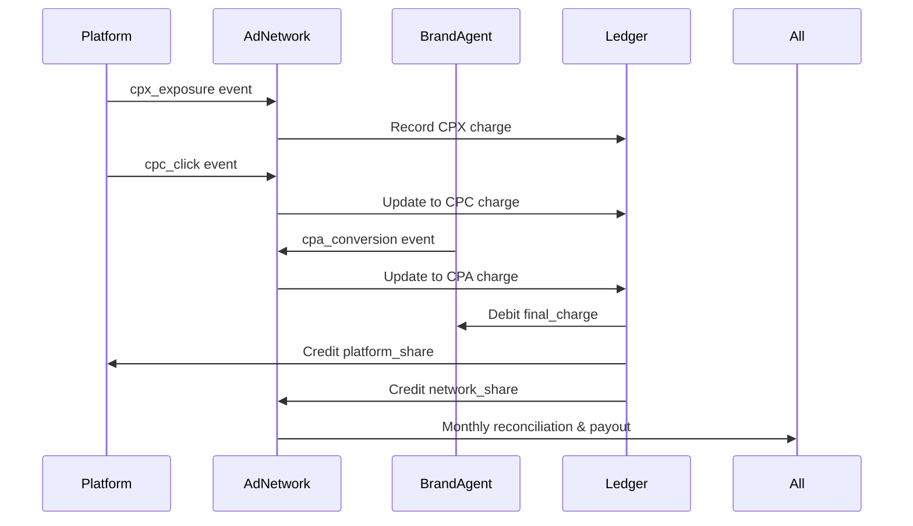

AIP includes a transparent, automated billing system that converts verified events into wallet balances and monthly payouts.  
Each participant — Platform, Ad Network, and Brand Agent — has their own wallet and ledger entries.

---

## 1. TL;DR

> Wallets record verified value. Payouts distribute that value fairly, automatically, and on schedule.

---

## 2. Why it matters

Legacy ad systems rely on delayed invoicing, reconciliation spreadsheets, and manual payouts.  
AIP replaces that with **real-time, cryptographically verifiable ledgers**.  

This ensures:
- No payment disputes  
- Real-time visibility into balances  
- Deterministic reconciliation for all parties  

---

## 3. Participants and Wallets

| Participant | Purpose | Example Entries |
|--------------|----------|-----------------|
| **AI Platform Wallet** | Receives revenue share for verified CPX/CPC events | Exposure fees, click revenue |
| **Ad Network Wallet** | Holds temporary balances and manages ledger settlements | Pending payouts, operator fees |
| **Brand Agent Wallet** | Tracks advertiser spend and CPA confirmations | Bids placed, conversions billed |

Every transaction in AIP is linked to a **`ledger_entry_id`** and **`serve_token`**, ensuring perfect traceability.

---

## 4. Payout Flow



The flow runs continuously, with monthly finalization for confirmed balances.

---

## 5. Example Ledger Entry

```json
{
  "serve_token": "stk_abcxyz123",
  "session_id": "s_001",
  "platform_id": "pf_chatapp",
  "agent_id": "ag_123",
  "auction_id": "auc_981",
  "state": "FINALIZED",
  "final_unit": "CPA",
  "final_charge": "10.00",
  "currency": "USD",
  "timestamps": {
    "auction": "2025-11-11T18:00:00Z",
    "exposure": "2025-11-11T18:00:00Z",
    "click": "2025-11-11T18:02:00Z",
    "conversion": "2025-11-11T18:30:00Z",
    "finalized": "2025-11-11T19:00:00Z"
  },
  "charges": {
    "cpx": "0.034",
    "cpc": "0.45",
    "cpa": "10.00"
  },
  "revenue_share": {
    "platform_share": "3.00",
    "network_share": "7.00"
  }
}
```

Each entry maps one verified event to monetary movement across wallets.

For complete ledger schema, see: [Ledger Record Schema](/schemas/ledger-record)

---

## 6. Payout Scheduling

| Cycle | Description | Responsible |
|--------|--------------|--------------|
| **Real-Time** | Balances update instantly on verified events | Ledger API |
| **Daily** | Ledger snapshots for reporting and reconciliation | Ad Network |
| **Monthly** | Payouts triggered for finalized balances | Ad Network + Settlement Service |

Payouts can be processed via:
- Direct bank transfer  
- Stripe Connect  
- Crypto-compatible ledgers (optional extension)

---

## 7. Handling disputes or reversals

AIP minimizes disputes by making all transactions **verifiable and signed**.  
But if discrepancies occur:
1. A dispute is logged with supporting evidence.  
2. Ad Network validates via the event ledger.  
3. If confirmed invalid, funds revert to originating wallets.  

All adjustments are recorded transparently under a new `revision_id`.

---

## 8. Guarantees

- No manual invoicing — all payouts are event-driven.  
- Balances and ledgers are cryptographically signed.  
- Each participant can verify their own ledger independently.  
- Settlement delays or fraud are mathematically impossible under AIP rules.

---

## Summary

> AIP wallets turn verified intent into money — instantly, transparently, and without reconciliation headaches.

Next: [Security](/security)
